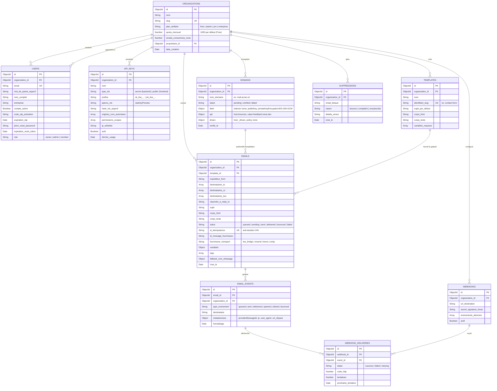

# 🗄️ 02. Modélisation Base de Données (MongoDB)

Ce document présente l'architecture des données sous MongoDB, le diagramme visuel des entités et relations pour les **9 collections fondamentales** de TUMA Cloud, les spécifications techniques exhaustives et la stratégie d'indexation de performance.

---

## 1. Schéma Relationnel Visuel (Diagramme Entité-Relation)

> 🎨 **Fichier source Draw.io** : [`docs/diagrams/02-database-model.drawio`](./diagrams/02-database-model.drawio) *(Ouvrable directement dans [app.diagrams.net](https://app.diagrams.net) ou via l'extension VS Code Draw.io)*

---

## 2. Spécification Détaillée des Collections

### 1. `users`
Enregistre les comptes utilisateurs et gère les flux cryptographiques d'activation et de réinitialisation.
- `_id` *(ObjectId, PK)* : Identifiant unique de l'utilisateur.
- `organizationId` *(ObjectId, FK)* : Organisation de rattachement.
- `email` *(String, Unique, Minuscule)* : Identifiant de connexion principal.
- `passwordHash` *(String)* : Empreinte sécurisée du mot de passe calculée avec **Argon2id**.
- `name` *(String)* : Nom complet de l'utilisateur.
- `company` *(String, Optionnel)* : Entreprise ou organisation associée.
- `isActivated` *(Boolean, Défaut: false)* : Indicateur d'activation du compte.
- `otpCode` *(String, 6 chiffres)* : Code à usage unique pour l'activation.
- `otpExpiresAt` *(Date)* : Heure d'expiration du code OTP (24 heures).
- `resetToken` *(String, 32 octets hex)* : Jeton cryptographique de réinitialisation de mot de passe.
- `resetTokenExpiresAt` *(Date)* : Heure d'expiration du jeton de réinitialisation (60 minutes).
- `role` *(String, Enum: `'owner' | 'admin' | 'member'`)* : Niveau de privilèges au sein de l'organisation.

### 2. `organizations`
Représente l'espace de travail multi-tenant et gère les quotas d'expédition.
- `_id` *(ObjectId, PK)* : Identifiant unique de l'organisation.
- `name` *(String)* : Nom commercial de l'organisation.
- `slug` *(String, Unique)* : Identifiant lisible d'espace de travail.
- `plan` *(String, Défaut: `'free'`)* : Plan tarifaire (`free`, `starter`, `pro`, `enterprise`).
- `monthlyQuota` *(Number, Défaut: `1000`)* : Volume d'emails alloué mensuellement (1 000 emails offerts à vie sur le plan Free).
- `usedMonthlyQuota` *(Number, Défaut: `0`)* : Compteur d'emails consommés sur la période en cours.
- `ownerId` *(ObjectId, FK)* : Référence vers l'utilisateur créateur et propriétaire.
- `createdAt` / `updatedAt` *(Date)*.

### 3. `api_keys`
Gère les clés d'accès programmatiques pour le backend et le frontend.
- `_id` *(ObjectId, PK)* : Identifiant unique de la clé.
- `organizationId` *(ObjectId, FK)* : Référence vers `organizations`.
- `name` *(String)* : Libellé descriptif (ex: `Production Kinshasa`, `Formulaire Contact Web`).
- `type` *(String, Enum: `'secret' | 'public'`)* :
  - `secret` : Clé d'API serveur privée (`sk_live_...`).
  - `public` : Clé d'API publique pour navigateur/mobile (`pk_live_...`).
- `prefix` *(String)* : Préfixe de la clé pour l'affichage console sécurisé.
- `rawKeyPreview` *(String)* : Aperçu sécurisé de la clé complète visible par le créateur.
- `keyHash` *(String)* : Hachage **Argon2id** de la clé secrète pour validation en temps constant.
- `allowedOrigins` *(Array of Strings)* : Whitelist CORS pour les clés publiques (`["https://monsite.cd"]` ou `["*"]`).
- `scopes` *(Array of Strings)* : Permissions attribuées (`["emails:send", "templates:read"]`).
- `ipWhitelist` *(String)* : Filtrage optionnel par adresse IP source.
- `isActive` *(Boolean, Défaut: true)* : État actif ou révoqué.
- `lastUsedAt` *(Date, Nullable)* : Horodatage du dernier appel API authentifié.

### 4. `domains`
Stocke les domaines d'expéditeurs personnalisés et leurs clés de délivrabilité.
- `_id` *(ObjectId, PK)* : Identifiant unique du domaine.
- `organizationId` *(ObjectId, FK)* : Organisation propriétaire.
- `name` *(String, Minuscule)* : Nom de domaine complet (ex: `kivutech.cd`).
- `status` *(String, Enum: `'pending' | 'verified' | 'failed'`)* : État de conformité DNS global.
- `dkim` *(Object)* :
  - `selector` : Sélecteur standardisé (`tuma`).
  - `publicKey` : Clé publique RSA 2048 au format DNS TXT pur (sans en-têtes PEM).
  - `privateKeyEncrypted` : Clé privée RSA 2048 chiffrée avec **AES-256-GCM** via la clé maître `MASTER_ENCRYPTION_KEY`.
  - `host` : Sous-domaine d'interrogation (`tuma._domainkey.kivutech.cd`).
  - `value` : Valeur attendue (`v=DKIM1; k=rsa; p=...`).
  - `status` : `'pending' | 'verified' | 'failed'`.
- `spf` *(Object)* :
  - `host` : Sous-domaine de rebond (`bounces.kivutech.cd`).
  - `value` : CNAME vers `feedback.tuma.dev`.
  - `status` : `'pending' | 'verified' | 'failed'`.
- `dmarc` *(Object)* :
  - `host` : `_dmarc.kivutech.cd`.
  - `value` : `v=DMARC1; p=none; rua=mailto:dmarc-reports@tuma.dev`.
  - `status` : `'pending' | 'verified' | 'failed'`.
- `verifiedAt` *(Date, Nullable)* : Date de validation DNS.

### 5. `templates`
Modèles d'emails dynamiques avec moteur Handlebars.
- `_id` *(ObjectId, PK)* : Identifiant unique du modèle.
- `organizationId` *(ObjectId, FK)* : Organisation propriétaire.
- `name` *(String)* : Nom lisible du template.
- `slug` *(String)* : Identifiant d'appel dans l'API (ex: `contact-form`, `order-shipped`).
- `subject` *(String)* : Modèle de sujet avec variables Handlebars (`{{clientName}}`).
- `html` *(String)* : Gabarit HTML avec styles et variables.
- `text` *(String, Optionnel)* : Gabarit texte brut alternatif.
- `requiredVariables` *(Array of Strings)* : Liste stricte des variables obligatoires lors de l'appel.

### 6. `emails`
Journal immuable de chaque email traité par le pipeline TUMA Cloud.
- `_id` *(ObjectId, PK)* : Identifiant unique de l'email.
- `organizationId` *(ObjectId, FK)* : Organisation émettrice.
- `templateId` *(ObjectId, FK, Nullable)* : Modèle ayant servi à générer le message.
- `from` *(String)* : Adresse d'expédition (`Kivu Tech <contact@kivutech.cd>`).
- `to` *(Array of Strings)* : Adresses des destinataires principaux.
- `cc` / `bcc` *(Array of Strings)* : Destinataires en copie conforme / invisible.
- `replyTo` *(String, Optionnel)* : Adresse de réponse.
- `subject` *(String)* : Sujet résolu du message.
- `html` / `text` *(String)* : Contenus HTML et texte brut générés.
- `status` *(String, Enum: `'queued' | 'sending' | 'sent' | 'delivered' | 'bounced' | 'failed'`)*.
- `idempotencyKey` *(String, Optionnel, Unique par organisation)* : Clé anti-doublon.
- `provider` *(String)* : Fournisseur d'expédition (`lws_bridge`, `resend`, `brevo`, `smtp_relay`).
- `providerMessageId` *(String, Optionnel)* : Identifiant RFC 5322 retourné par le relais SMTP.
- `variables` *(Object)* : Variables passées pour la compilation du template.
- `tags` *(Array of Objects)* : Métadonnées de suivi (`[{ name, value }]`).
- `fallback` *(Object, Optionnel)* : Configuration de repli SMS / WhatsApp si l'email n'est pas ouvert sous 4h.
- `errorMessage` *(String, Optionnel)* : Détail d'erreur en cas d'échec d'envoi.

### 7. `email_events`
Chronologie détaillée des interactions et états du message.
- `_id` *(ObjectId, PK)* : Identifiant unique de l'événement.
- `emailId` *(ObjectId, FK)* : Référence vers le message `emails`.
- `organizationId` *(ObjectId, FK)* : Organisation concernée.
- `type` *(String, Enum: `'queued' | 'sent' | 'delivered' | 'opened' | 'clicked' | 'bounced' | 'failed'`)*.
- `recipient` *(String)* : Adresse email concernée.
- `metadata` *(Object)* : Données contextuelles (IP, User-Agent, URL cliquée, code diagnostic SMTP).
- `timestamp` *(Date)* : Date exacte de l'événement.

### 8. `suppressions`
Liste de protection de réputation O(1).
- `_id` *(ObjectId, PK)* : Identifiant unique.
- `organizationId` *(ObjectId, FK)* : Organisation concernée.
- `email` *(String, Minuscule)* : Adresse email bloquée.
- `reason` *(String, Enum: `'bounce' | 'complaint' | 'unsubscribe'`)*.
- `details` *(String, Optionnel)* : Motif ou code d'erreur SMTP renvoyé.
- `createdAt` *(Date)* : Date d'ajout à la liste de suppression.

### 9. `webhooks` & `webhook_deliveries`
Système de notification en temps réel vers les infrastructures clientes.
- `webhooks` : URL de destination HTTPS, secret HMAC-SHA256, événements souscrits, statut actif/inactif.
- `webhook_deliveries` : Journal d'audit de chaque notification transmise (code HTTP, temps de réponse, tentative, payload).

---

## 3. Stratégie d'Indexation & Optimisations de Performance

| Collection | Index MongoDB | Type | Rationale Technique |
| :--- | :--- | :--- | :--- |
| `users` | `{ email: 1 }` | Unique | Connexion et inscription instantanées (< 1ms). |
| `users` | `{ resetToken: 1 }` | Sparse / B-Tree | Recherche immédiate lors du clic sur le lien de réinitialisation. |
| `organizations` | `{ slug: 1 }` | Unique | Résolution rapide de l'espace de travail. |
| `api_keys` | `{ keyHash: 1, isActive: 1 }` | B-Tree | Authentification ultra-performante à chaque requête d'API REST. |
| `domains` | `{ organizationId: 1, name: 1 }` | Unique Composé | Empêche les doublons de domaine au sein d'une organisation. |
| `emails` | `{ organizationId: 1, idempotencyKey: 1 }` | Unique / Sparse | Idempotence stricte : élimine tout doublon d'envoi en cas de retry client. |
| `emails` | `{ organizationId: 1, createdAt: -1 }` | Composé | Affichage paginé instantané des logs dans la console TUMA. |
| `emails` | `{ status: 1 }` | B-Tree | Traitement immédiat des emails orphelins lors du redémarrage du serveur. |
| `suppressions` | `{ organizationId: 1, email: 1 }` | Unique Composé | Vérification en $O(1)$ à l'ingestion avant d'accepter le message. |
| `email_events` | `{ emailId: 1, timestamp: 1 }` | Composé | Restitution instantanée de la timeline d'un email. |

