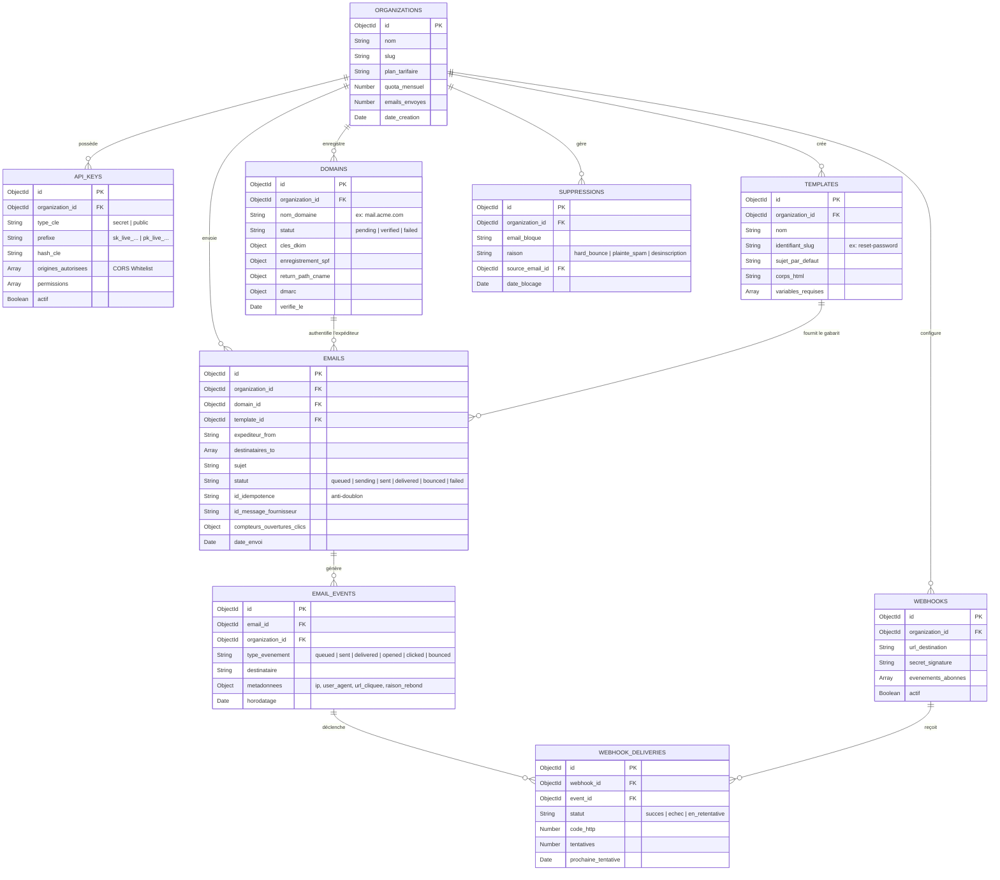

# 🗄️ 02. Modélisation Base de Données (MongoDB)

Ce document présente l'architecture des données sous MongoDB, le diagramme visuel des entités et relations, les spécifications des collections et les index de performance indispensables.

---

## 1. Schéma Relationnel Visuel (Diagramme Entité-Relation)

> 🎨 **Fichier source Draw.io** : [`docs/diagrams/02-database-model.drawio`](./diagrams/02-database-model.drawio) *(Ouvrable directement dans [app.diagrams.net](https://app.diagrams.net) ou via l'extension VS Code Draw.io)*

---

## 2. Spécification Détaillée des Collections

### 1. `organizations`
Représente le compte client principal ou l'espace de travail.
- `_id` *(ObjectId, PK)* : Identifiant unique.
- `name` *(String)* : Nom commercial de l'organisation.
- `slug` *(String, Unique)* : Identifiant lisible pour l'espace de travail (ex: `acme-corp`).
- `plan` *(String)* : Plan tarifaire (`free`, `pro`, `enterprise`).
- `monthlyQuota` *(Number)* : Nombre maximum d'emails autorisés par mois.
- `usageCount` *(Number)* : Compteur d'emails consommés sur le cycle en cours.
- `settings` *(Object)* : Préférences globales (activation du tracking d'ouverture, de clics, etc.).
- `createdAt` / `updatedAt` *(Date)*.

### 2. `api_keys`
Gère les clés d'accès programmatiques.
- `_id` *(ObjectId, PK)* : Identifiant unique.
- `organizationId` *(ObjectId, FK)* : Référence vers `organizations`.
- `name` *(String)* : Nom descriptif (ex: `Production API Server`, `Formulaire Landing Page`).
- `prefix` *(String)* : Préfixe non-secret pour affichage sécurisé (ex: `sk_live_9a8b...` ou `pk_live_1c2d...`).
- `keyHash` *(String)* : Empreinte cryptographique de la clé secrète (Argon2id ou Bcrypt).
- `type` *(String)* : `secret` (backend uniquement) ou `public` (frontend/mobile).
- `allowedOrigins` *(Array of Strings)* : Liste des domaines autorisés pour les clés publiques (ex: `["https://acme.com"]`).
- `scopes` *(Array of Strings)* : Permissions accordées (ex: `["emails.send", "domains.read"]`).
- `isActive` *(Boolean)* : Indicateur d'activation immédiate ou de révocation.
- `lastUsedAt` *(Date)* : Horodatage du dernier appel valide.

### 3. `domains`
Stocke les domaines d'expéditeurs et leur état d'authentification DNS.
- `_id` *(ObjectId, PK)* : Identifiant unique.
- `organizationId` *(ObjectId, FK)* : Référence vers `organizations`.
- `name` *(String)* : Nom de domaine (ex: `mail.acme.com`).
- `status` *(String)* : Statut actuel (`pending`, `verified`, `failed`).
- `dnsRecords` *(Object)* :
  - `dkim` : Enregistrement TXT avec clé publique RSA 2048 (`resend._domainkey.mail.acme.com`).
  - `spf` / `returnPath` : Enregistrement CNAME pointant vers le serveur de rebonds.
  - `dmarc` : Enregistrement TXT (`_dmarc.mail.acme.com`).
- `verifiedAt` *(Date, Nullable)* : Date à laquelle toutes les entrées DNS ont été confirmées.

### 4. `templates`
Modèles d'emails réutilisables avec gabarits Handlebars.
- `_id` *(ObjectId, PK)* : Identifiant unique.
- `organizationId` *(ObjectId, FK)* : Référence vers `organizations`.
- `name` *(String)* : Nom humain (ex: `Réinitialisation de mot de passe`).
- `slug` *(String)* : Identifiant d'appel dans l'API (ex: `password-reset`).
- `subject` *(String)* : Modèle de sujet (ex: `Réinitialisez votre mot de passe pour {{appName}}`).
- `htmlContent` *(String)* : Corps HTML contenant les balises `{{variable}}`.
- `textContent` *(String)* : Version texte brut alternative.
- `requiredVariables` *(Array of Strings)* : Liste des variables requises pour validation avant envoi.

### 5. `emails`
Enregistrement de chaque message pris en charge par la plateforme.
- `_id` *(ObjectId, PK)* : Identifiant unique du message (`email_...`).
- `organizationId` *(ObjectId, FK)* : Organisation émettrice.
- `domainId` *(ObjectId, FK, Nullable)* : Domaine d'expéditeur utilisé.
- `idempotencyKey` *(String, Nullable)* : Clé anti-doublon transmise par le client.
- `from` *(String)* : Adresse d'expéditeur avec nom optionnel (`Support <support@mail.acme.com>`).
- `to` *(Array of Strings)* : Liste des destinataires principaux.
- `cc` / `bcc` / `replyTo` *(Array of Strings / String)*.
- `subject` *(String)* : Sujet résolu du message.
- `bodyHtml` / `bodyText` *(String)* : Contenu final généré.
- `status` *(String)* : État courant (`queued`, `sending`, `sent`, `delivered`, `bounced`, `complained`, `failed`).
- `provider` *(String)* : Moteur de transport utilisé (`smtp`, `ses`, `mailpit_mock`).
- `providerMessageId` *(String, Nullable)* : ID renvoyé par le serveur de transport SMTP/SES.
- `stats` *(Object)* : Compteurs d'interaction (`openCount`, `clickCount`, `firstOpenedAt`, `lastOpenedAt`).
- `tags` *(Array of Objects)* : Métadonnées personnalisées fournies par le client (`{ name, value }`).

### 6. `email_events`
Journal d'audit immuable de tous les événements liés aux emails.
- `_id` *(ObjectId, PK)* : Identifiant unique de l'événement.
- `emailId` *(ObjectId, FK)* : Référence vers `emails`.
- `organizationId` *(ObjectId, FK)* : Organisation concernée.
- `type` *(String)* : Type d'événement (`email.queued`, `email.sent`, `email.delivered`, `email.opened`, `email.clicked`, `email.bounced`, `email.complained`).
- `recipient` *(String)* : Adresse email du destinataire associé.
- `metadata` *(Object)* :
  - Pour les ouvertures/clics : `{ ip, userAgent, linkUrl }`.
  - Pour les rebonds : `{ bounceType: "hard"|"soft", diagnosticCode, remoteMta }`.
- `timestamp` *(Date)* : Date exacte de l'événement.

### 7. `suppressions`
Liste noire / protection de réputation.
- `_id` *(ObjectId, PK)* : Identifiant unique.
- `organizationId` *(ObjectId, FK)* : Organisation concernée.
- `email` *(String)* : Adresse email bloquée en minuscules.
- `reason` *(String)* : Motif du blocage (`hard_bounce`, `spam_complaint`, `unsubscribe`).
- `sourceEmailId` *(ObjectId, FK, Nullable)* : Email à l'origine du blocage.
- `details` *(String, Nullable)* : Message d'erreur renvoyé par le serveur distant.
- `createdAt` *(Date)*.

### 8. `webhooks` & `webhook_deliveries`
Configuration et historique des notifications sortantes vers les serveurs clients.
- `webhooks` : URL de destination, clé secrète de signature HMAC, liste des événements abonnés, statut actif/inactif.
- `webhook_deliveries` : Trace de chaque tentative d'envoi HTTP avec code de réponse, corps, nombre d'essais et date de la prochaine tentative en cas d'échec.

---

## 3. Stratégie d'Indexation & Optimisations de Performance

| Collection | Index MongoDB | Type | Objectif |
| :--- | :--- | :--- | :--- |
| `api_keys` | `{ keyHash: 1 }` | Haché / B-Tree | Authentification ultra-rapide (< 1ms) sur chaque appel API. |
| `emails` | `{ organizationId: 1, idempotencyKey: 1 }` | Unique / Sparse | Empêche tout double envoi accidentel en cas de retry client. |
| `emails` | `{ organizationId: 1, createdAt: -1 }` | Composé | Affichage paginé instantané des logs dans le dashboard. |
| `suppressions` | `{ organizationId: 1, email: 1 }` | Unique | Vérification en $O(1)$ à l'ingestion avant d'accepter l'email. |
| `domains` | `{ organizationId: 1, name: 1 }` | Unique | Unicité du nom de domaine par organisation. |
| `email_events` | `{ emailId: 1, timestamp: 1 }` | Composé | Reconstruction chronologique de la timeline d'un email. |
| `email_events` | `{ timestamp: 1 }` *(expireAfterSeconds: 7776000)* | TTL Index | Archivage ou purge automatique après 90 jours (optionnel). |
