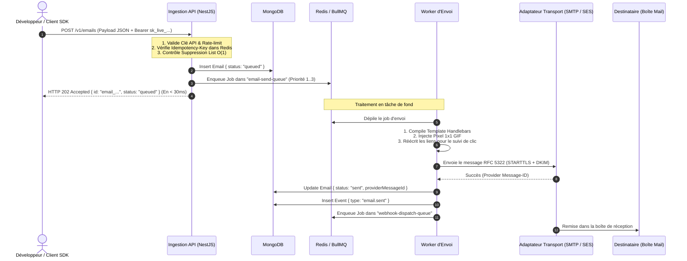
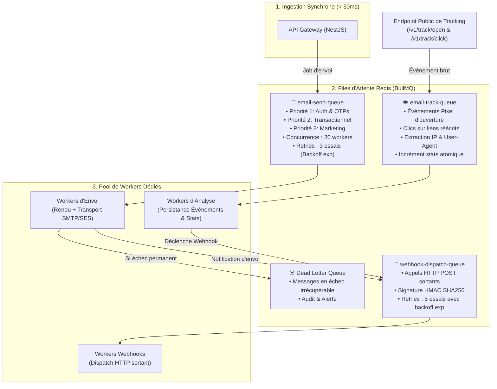
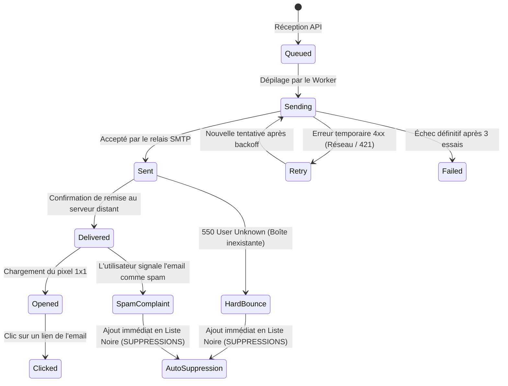

# ⚙️ 03. Pipeline d'Envoi Asynchrone & Architecture des Files d'Attente

Ce document détaille l'architecture distribuée du moteur d'envoi, le traitement asynchrone orchestré par **Redis et BullMQ**, le protocole de tracking en temps réel, l'analyse des rebonds SMTP et la tolérance aux pannes.

---

## 1. Vue d'Ensemble & Cycle de Vie Asynchrone

Pour garantir une ingestion ultra-rapide ($< 30\text{ms}$), le système sépare strictement **l'acceptation de la requête** (synchrone) de **l'exécution lourde** (asynchrone : compilation, injection de tracking, transport SMTP/SES, webhooks).

> 🎨 **Fichiers sources Draw.io** :
> - **Pipeline & 3 Queues** : [`docs/diagrams/03-pipeline-envoi-queues.drawio`](./diagrams/03-pipeline-envoi-queues.drawio)
> - **Cycle de Vie & Rebonds** : [`docs/diagrams/04-cycle-de-vie-tracking.drawio`](./diagrams/04-cycle-de-vie-tracking.drawio)



---

## 2. Architecture des 3 Files d'Attente Spécialisées (BullMQ)



### 2.1. Spécification des Files BullMQ

1. **`email-send-queue`** :
   - **Job Payload** : `{ emailId, organizationId, templateId, variables, priority }`.
   - **Concurrence** : 20 workers par instance Node.js.
   - **Stratégie de Retry** :
     - 1ère tentative : Immédiate.
     - 2ème tentative : Après 60 secondes (avec gigue aléatoire de 5s).
     - 3ème tentative : Après 5 minutes.
     - Échec final : Déplacement automatique dans la `Dead Letter Queue`.

2. **`email-track-queue`** :
   - **Job Payload** : `{ emailId, type: "open"|"click", ip, userAgent, url, timestamp }`.
   - **Concurrence** : 50 workers par instance (opérations ultra-légères en base).
   - **Rôle** : Incrémentation atomique MongoDB `$inc: { "stats.openCount": 1 }` et insertion de l'événement dans `email_events`.

3. **`webhook-dispatch-queue`** :
   - **Job Payload** : `{ webhookId, eventType, payload, secret, attempt: 1 }`.
   - **Concurrence** : 15 workers par instance.
   - **Timeout d'appel HTTP** : 5 000 ms.
   - **Retry Schedule** : 1m $\rightarrow$ 5m $\rightarrow$ 30m $\rightarrow$ 2h $\rightarrow$ 8h.

---

## 3. Mécanisme de Télémétrie en Direct (Tracking Engine)

### 3.1. Pixel d'Ouverture Transparent ($1\times 1$ GIF)
Le worker d'envoi injecte automatiquement en fin de balise `</body>` :
```html

```

#### Réponse HTTP du Serveur de Tracking
- **Code HTTP** : `200 OK`.
- **Content-Type** : `image/gif`.
- **En-têtes anti-cache** :
  ```http
  Cache-Control: no-store, no-cache, must-revalidate, max-age=0
  Pragma: no-cache
  Expires: 0
  ```
- **Contenu Binaire (43 octets - GIF transparent)** :
  `47 49 46 38 39 61 01 00 01 00 80 00 00 ff ff ff 00 00 00 21 f9 04 01 00 00 00 00 2c 00 00 00 00 01 00 01 00 00 02 02 44 01 00 3b`

### 3.2. Proxy de Redirection des Clics
Tous les liens `href="..."` sont réécrits lors de la compilation :
- **Lien Original** : `<a href="https://acme.com/promo?id=42">Voir la promo</a>`
- **Lien Réécrit** : `<a href="https://track.monplateforme.com/v1/track/click/TOKEN_SIGNE?url=https%3A%2F%2Facme.com%2Fpromo%3Fid%3D42">Voir la promo</a>`

1. L'utilisateur clique sur le lien.
2. Le serveur de tracking reçoit la requête, valide la signature HMAC du token, et publie l'événement dans `email-track-queue`.
3. Le serveur retourne immédiatement un code **HTTP 302 Found** avec l'en-tête `Location: https://acme.com/promo?id=42`.

---

## 4. Gestion des Rebonds (Bounces) & Protection de Réputation



### 4.1. Typologie des Erreurs SMTP
1. **Soft Bounces (Codes SMTP 4xx)** : Boîte aux lettres pleine (452), serveur distant temporairement saturé (421).
   - *Traitement* : Re-tentatives espacées sur 24 heures.
2. **Hard Bounces (Codes SMTP 5xx)** : Adresse inexistante (550), domaine invalide (512).
   - *Traitement* : Statut immédiat `bounced`, insertion instantanée dans `suppressions`, émission du webhook `email.bounced`.
3. **Plaintes Spam (Feedback Loops - FBL)** : L'utilisateur clique sur "Signaler comme spam" dans Gmail/Yahoo/Outlook.
   - *Traitement* : Statut immédiat `complained`, inscription irréversible dans `suppressions`, émission du webhook `email.complained`.
