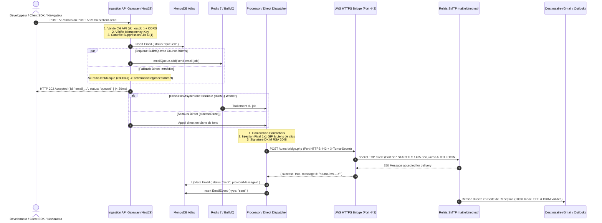
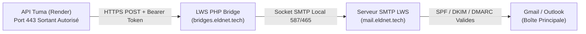
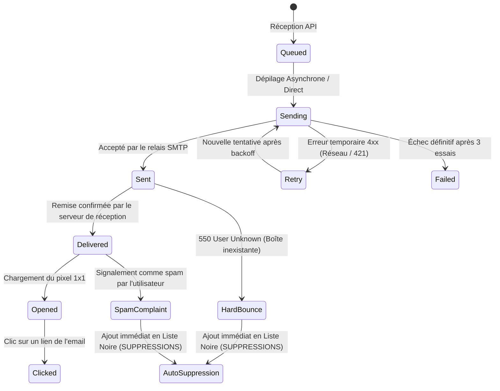

# ⚙️ 03. Pipeline d'Envoi Asynchrone, Cascade Multi-Transports & Télémétrie

Ce document détaille l'architecture distribuée du moteur d'envoi de **TUMA Cloud**, son pipeline hybride ultra-résilient (BullMQ + bascule directe instantanée), la cascade multi-transports contournant les blocages de ports SMTP (LWS HTTPS Bridge), le moteur cryptographique DKIM et la télémétrie en temps réel.

---

## 1. Vue d'Ensemble & Cycle de Vie Hybride Résilient

Pour garantir une ingestion ultra-rapide ($< 30\text{ms}$) tout en maintenant une haute disponibilité en environnement Cloud/Serverless (où Redis ou les ports SMTP peuvent subir des restrictions), TUMA Cloud déploie une **architecture hybride d'ingestion à triple sécurité** :



---

## 2. Le Mécanisme d'Ingestion Hybride à Triple Sécurité

Dans `EmailsService` ([emails.service.ts](file:///home/benny-nkonga/Documents/antigravity/tuma/apps/api/src/modules/emails/emails.service.ts)), TUMA Cloud résout les défaillances courantes de files d'attente grâce à 3 garde-fous logiciels :

1. **Course avec Timeout (Promise.race 800ms)** :
   L'envoi du job vers Redis est soumis à une course d'au plus 800ms. Si Redis est saturé, en veille ou inaccessible, le système bascule immédiatement sur `processDirect` sans faire échouer l'appel du client.
2. **Auto-Dispatcher de Secours à 1 seconde** :
   Un minuteur non-bloquant interroge MongoDB 1 000ms après la création de l'email. Si son statut est toujours à `queued` (indiquant que BullMQ n'a pas pu traiter le message), il déclenche automatiquement le dispatcher de secours.
3. **Récupération au Démarrage (`OnApplicationBootstrap`)** :
   Au redémarrage du conteneur API (déploiement Render, failover), une sonde scanne les emails orphelins en statut `queued` et les expédie immédiatement pour éliminer toute perte de message.

---

## 3. Cascade Multi-Transports & Contournement des Blocages SMTP

### Le Problème du Cloud Moderne
Les plateformes PaaS cloud (Render Free, Vercel, AWS Fargate, DigitalOcean App Platform) **bloquent systématiquement les ports sortants 25, 465 et 587** pour prévenir l'émission de spam. Un serveur SMTP classique subit un timeout (`ETIMEDOUT` ou `ECONNREFUSED`).

### La Solution TUMA Cloud : LWS HTTPS Bridge
TUMA intègre un adaptateur passerelle sécurisé via un script PHP déposé sur l'hébergement d'expédition (`bridges.eldnet.tech/tuma-bridge.php`) :



#### Cascade de Priorités du Transporteur ([MailpitTransporter](file:///home/benny-nkonga/Documents/antigravity/tuma/apps/api/src/modules/transporters/mailpit.transporter.ts)) :
1. **Priorité 1 : LWS HTTPS Bridge via Socket SMTP Authentifié** :
   Le pont établit une négociation socket directe avec `mail.eldnet.tech` (STARTTLS port 587 ou SSL port 465) avec authentification `AUTH LOGIN`. Le message est émis avec l'enveloppe légitime du domaine, ce qui lève l'alerte Spam de Gmail.
2. **Priorité 2 : APIs HTTPS Externes (Port 443)** :
   Prise en charge native de **Resend HTTPS API** (`RESEND_API_KEY`) et **Brevo HTTPS API v3** (`BREVO_API_KEY`).
3. **Priorité 3 : Relais SMTP Standard** :
   Nodemailer classique sur ports 587/465 (utilisé si l'hôte réseau n'est pas bloqué).
4. **Priorité 4 : Simulateur Edge Local** :
   En environnement de développement local ou hors-ligne, génération d'un Message-ID simulé sans lever d'exception.

---

## 4. Moteur Cryptographique DKIM (RSA 2048)

Pour les domaines d'expéditeurs personnalisés, TUMA Cloud signe les courriels conformément à la norme **RFC 6376** :

1. **Paire de clés asymétriques** : Générée via `crypto.generateKeyPairSync('rsa', { modulusLength: 2048 })`.
2. **Coffre-fort au repos (AES-256-GCM)** : La clé privée est chiffrée avec la clé maître `MASTER_ENCRYPTION_KEY` :
   ```typescript
   const cipher = crypto.createCipheriv('aes-256-gcm', masterKey, iv);
   ```
3. **Injection de l'en-tête DKIM-Signature** :
   Avant expédition, Nodemailer calcule le hachage du corps (`bh=`) en SHA-256 et signe les en-têtes canonisés avec la clé privée déchiffrée :
   ```http
   DKIM-Signature: v=1; a=rsa-sha256; c=relaxed/relaxed; d=acme.cd; s=tuma;
     bh=uU0TU84EkPjh5z1J2c...;
     b=kL49Xy00...;
   ```

---

## 5. Moteur de Télémétrie en Direct (Tracking Engine)

### 5.1. Pixel d'Ouverture Transparent ($1\times 1$ GIF)
Le processeur injecte automatiquement en fin de balise `</body>` :
```html

```

#### Réponse HTTP du Serveur de Tracking
- **Code HTTP** : `200 OK`.
- **Content-Type** : `image/gif`.
- **En-têtes anti-cache stricts** :
  ```http
  Cache-Control: no-store, no-cache, must-revalidate, max-age=0
  Pragma: no-cache
  Expires: 0
  ```
- **Contenu Binaire (43 octets - GIF transparent)** :
  `47 49 46 38 39 61 01 00 01 00 80 00 00 ff ff ff 00 00 00 21 f9 04 01 00 00 00 00 2c 00 00 00 00 01 00 01 00 00 02 02 44 01 00 3b`

### 5.2. Proxy de Redirection des Clics
Tous les liens `<a href="...">` sont réécrits lors de la compilation :
- **Lien Original** : `<a href="https://acme.cd/facture">Voir ma facture</a>`
- **Lien Réécrit** : `<a href="https://api.tuma.eldnet.tech/v1/tracking/click/TOKEN_SIGNE?url=https%3A%2F%2Facme.cd%2Ffacture">Voir ma facture</a>`

1. L'utilisateur clique sur le lien.
2. Le proxy enregistre l'événement `clicked` avec l'adresse IP et le User-Agent dans MongoDB.
3. Le serveur renvoie immédiatement une redirection **HTTP 302 Found** vers l'URL d'origine.

---

## 6. Gestion des Rebonds (Bounces) & Protection de Réputation



### 6.1. Typologie des Erreurs & Auto-Suppression
1. **Soft Bounces (Codes SMTP 4xx)** : Boîte aux lettres pleine (452), serveur distant temporairement saturé (421).
   - *Traitement* : Re-tentatives automatiques espacées.
2. **Hard Bounces (Codes SMTP 5xx)** : Adresse inexistante (550), domaine invalide (512).
   - *Traitement* : Statut immédiat `bounced`, insertion instantanée dans `suppressions`, émission du webhook `email.bounced`.
3. **Plaintes Spam (Feedback Loops - FBL)** : L'utilisateur clique sur "Signaler comme spam" dans Gmail/Yahoo/Outlook.
   - *Traitement* : Statut immédiat `complained`, inscription irréversible dans `suppressions`, émission du webhook `email.complained`.

