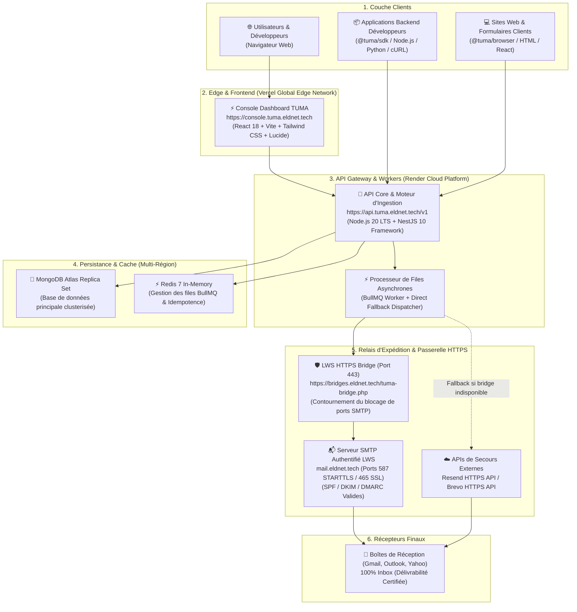
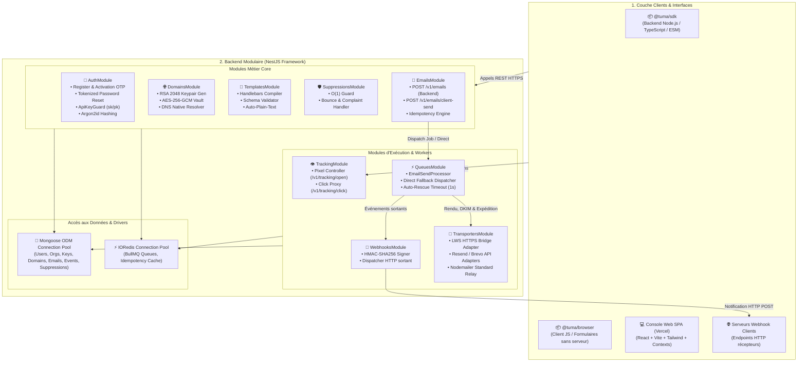

# 🛠️ 04. Stack Technique, Architecture des Composants & Infrastructure de Production

Ce document présente l'architecture fonctionnelle de **TUMA Cloud**, l'architecture interne des composants logiciels (modules NestJS, workers BullMQ, SDKs, console React), les choix technologiques et la topologie de déploiement en production (Render, Vercel, MongoDB Atlas, LWS Bridge).

---

## 1. Topologie d'Infrastructure de Production

TUMA Cloud est déployé sur une architecture cloud hybride à haute disponibilité combinant puissance de calcul, résilience de transport et délivrabilité 100% Inbox :



---

## 2. Architecture des Composants Logiciels

L'application repose sur une architecture modulaire **NestJS** découplée avec injection de dépendances, complétée par un pool de processeurs hybrides, la console web React et les packages SDK clients.

> 🎨 **Fichier source Draw.io** : [`docs/diagrams/06-architecture-composants.drawio`](./diagrams/06-architecture-composants.drawio)



---

## 3. Choix Technologiques & Justifications

| Composant | Technologie | Rôle & Rationale Technique |
| :--- | :--- | :--- |
| **Framework Backend** | **NestJS 10 (TypeScript)** | Architecture modulaire d'entreprise, injection de dépendances, décorateurs stricts et robustesse. |
| **Base de Données** | **MongoDB Atlas 7+ (Mongoose)** | Stockage flexible et évolutif pour les documents d'emails, logs de tracking et modèles polymorphes. |
| **Files d'Attente & Cache** | **Redis 7 & BullMQ** | Gestion haute performance des jobs asynchrones, priorités d'envoi et isolation des pics de trafic. |
| **Moteur de Templates** | **Handlebars.js** | Rendu rapide et sécurisé côté serveur avec interpolation de variables (`{{nom}}`). |
| **Cryptographie** | **Argon2id & AES-256-GCM** | Hachage résistant aux attaques GPU/ASIC pour les mots de passe et clés API, et chiffrement militaire pour les clés privées DKIM. |
| **Passerelle d'Envoi Cloud** | **LWS PHP Bridge (`tuma-bridge.php`)** | Contournement natif du blocage des ports SMTP 587/465 sur Render via HTTPS, garantissant la conformité SPF et DKIM. |
| **Console Développeur** | **React 18 + Vite + Tailwind CSS** | Interface ultra-rapide (déployée sur Vercel Edge), réactive, thème Obsidian/Emerald et commande palette (Cmd+K). |

---

## 4. Variables d'Environnement de Production (`.env`)

```ini
# ==============================================================================
# Configuration Générale de l'API
# ==============================================================================
PORT=3001
NODE_ENV=production
API_BASE_URL=https://api.tuma.eldnet.tech/v1
DASHBOARD_URL=https://console.tuma.eldnet.tech

# ==============================================================================
# Persistance MongoDB Atlas & Redis
# ==============================================================================
MONGODB_URI=mongodb+srv://<user>:<password>@cluster0.mongodb.net/tuma_production?retryWrites=true&w=majority
REDIS_HOST=redis-12345.c1.cloud.redislabs.com
REDIS_PORT=12345
REDIS_PASSWORD=votre_mot_de_passe_redis

# ==============================================================================
# Sécurité & Cryptographie
# ==============================================================================
JWT_SECRET=super_secret_jwt_key_pour_les_sessions_utilisateurs_production
MASTER_ENCRYPTION_KEY=0123456789abcdef0123456789abcdef0123456789abcdef0123456789abcdef

# ==============================================================================
# Passerelle SMTP & LWS Bridge (Anti-Spam & Anti-Blocage Port)
# ==============================================================================
SMTP_HOST=mail.eldnet.tech
SMTP_PORT=587
SMTP_USER=contact@eldnet.tech
SMTP_PASS=VotreMotDePasseBoiteEmailLWS
DEFAULT_FROM_EMAIL="Tuma Notifications <contact@eldnet.tech>"

LWS_BRIDGE_URL=https://bridges.eldnet.tech/tuma-bridge.php
LWS_BRIDGE_SECRET=53252ddafb841d3defe44023c025d56cd308a6dca1776d3f

# Fallbacks optionnels
RESEND_API_KEY=
BREVO_API_KEY=
```

---

## 5. Arborescence du Monorepo TUMA

```text
tuma/
├── apps/
│   ├── api/                          # Backend Core NestJS & Moteur d'Ingestion
│   │   ├── src/
│   │   │   ├── modules/
│   │   │   │   ├── auth/             # Inscription, OTP, Reset Password, Clés API (sk/pk), Guards
│   │   │   │   ├── domains/          # Génération DKIM RSA 2048, Chiffrement AES, Résolveur DNS
│   │   │   │   ├── emails/           # Endpoints POST /v1/emails et POST /v1/emails/client-send
│   │   │   │   ├── templates/        # Moteur Handlebars & CRUD Templates
│   │   │   │   ├── suppressions/     # Liste de suppression O(1) & Détection de rebonds
│   │   │   │   ├── tracking/         # Pixel 1x1 GIF transparent & Proxy de redirection de clics
│   │   │   │   ├── webhooks/         # Dispatcher d'événements sortants signés HMAC-SHA256
│   │   │   │   └── queues/           # Processeurs BullMQ et Dispatcher de secours direct
│   │   │   ├── transporters/         # LWS Bridge Adapter, Resend, Brevo, Nodemailer
│   │   │   ├── schemas/              # Schémas Mongoose (User, Org, ApiKey, Domain, Email...)
│   │   │   └── main.ts
│   │   └── package.json
│   │
│   └── dashboard/                    # Console Développeur React SPA (Vercel)
│       ├── src/
│       │   ├── pages/                # Overview, EmailsLogs, Domaines, Clés, Templates, Playground
│       │   ├── pages/auth/           # LoginPage, RegisterPage, ResetPasswordPage
│       │   ├── context/              # AuthContext (Sessions JWT, Activation, Reset)
│       │   ├── components/           # Layout, Header, CommandPalette, Modals, Tables, Charts
│       │   └── services/             # Client API (api.ts)
│       └── package.json
│
├── packages/
│   ├── sdk/                          # SDK Officiel Node.js (@tuma/sdk)
│   └── browser/                      # SDK Officiel Navigateur (@tuma/browser)
│
├── scripts/
│   └── tuma-bridge.php               # Passerelle HTTPS LWS déployée sur public_html
│
└── docs/                             # Documentation d'Architecture, Spécifications & Guides
```
