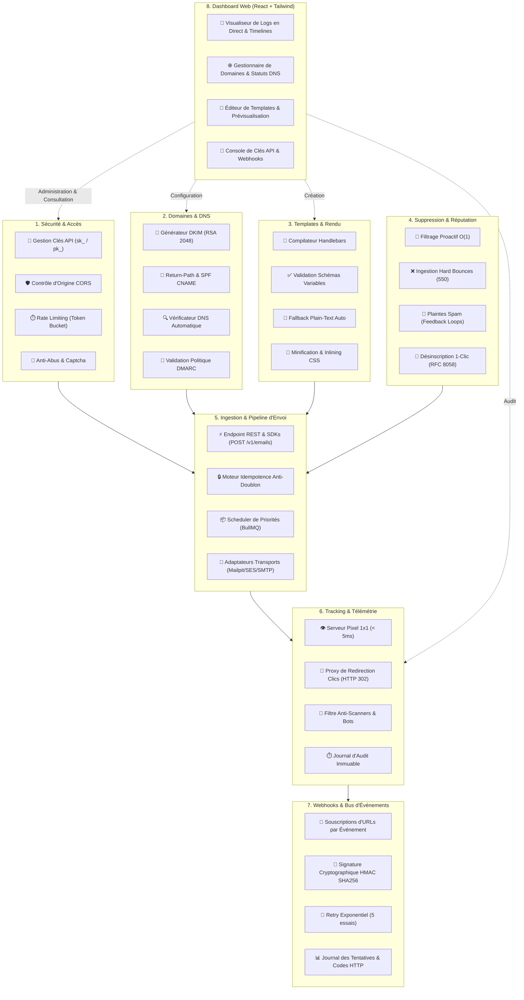
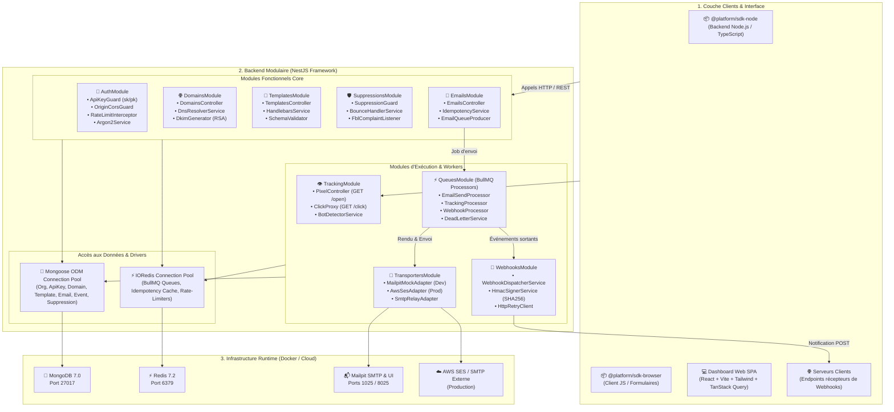
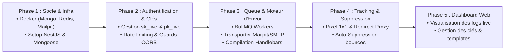

# 🛠️ 04. Stack Technique, Architecture des Composants & Environnement

Ce document présente l'architecture fonctionnelle de la plateforme, l'architecture interne des composants logiciels (modules NestJS, workers, SDKs, dashboard), les choix technologiques et la configuration de l'infrastructure locale Docker.

---

## 1. Architecture Fonctionnelle

L'architecture fonctionnelle organise la plateforme en **8 blocs fonctionnels interconnectés**, garantissant la sécurité des accès, la délivrabilité DNS, la résilience de l'envoi et la télémétrie en temps réel.

> 🎨 **Fichier source Draw.io** : [`docs/diagrams/05-architecture-fonctionnelle.drawio`](./diagrams/05-architecture-fonctionnelle.drawio) *(Ouvrable directement dans [app.diagrams.net](https://app.diagrams.net) ou via l'extension VS Code Draw.io)*



---

## 2. Architecture des Composants Logiciels

L'application repose sur une architecture modulaire **NestJS** découplée avec injection de dépendances, complétée par un pool de workers **BullMQ**, une interface **React (Vite + Tailwind)** et deux SDKs clients.

> 🎨 **Fichier source Draw.io** : [`docs/diagrams/06-architecture-composants.drawio`](./diagrams/06-architecture-composants.drawio) *(Ouvrable directement dans [app.diagrams.net](https://app.diagrams.net) ou via l'extension VS Code Draw.io)*



---

## 3. Choix Technologiques & Justifications

| Composant | Technologie | Rôle & Justification |
| :--- | :--- | :--- |
| **Framework Backend** | **NestJS (TypeScript)** | Architecture d'entreprise modulaire, injection de dépendances, décorateurs et maintenabilité. |
| **Base de Données** | **MongoDB 7+ (Mongoose)** | Stockage flexible et évolutif pour les payloads d'emails, logs de tracking et modèles de données polymorphes. |
| **Files d'Attente & Cache** | **Redis 7+ & BullMQ** | Gestion haute performance des jobs asynchrones, priorités d'envoi, rate-limiting et re-tentatives. |
| **Moteur de Templates** | **Handlebars.js** | Rendu rapide et sécurisé côté serveur avec interpolation de variables (`{{nom}}`). |
| **Transport de Mail (Dev)** | **Mailpit** | Serveur SMTP local léger avec interface Web pour intercepter et inspecter les emails envoyés en développement sans coût. |
| **Transport de Mail (Prod)**| **AWS SES / SMTP Provider** | Adaptateurs interchangeables pour l'expédition réelle à grande échelle. |
| **Dashboard Frontend** | **React + Vite + Tailwind CSS** | Interface réactive, moderne et rapide pour visualiser les logs, gérer les domaines et configurer les clés d'API. |

---

## 4. Environnement de Développement Local (`docker-compose.yml`)

Pour développer sans friction, la stack locale complète s'exécute sous Docker :

```yaml
version: '3.8'

services:
  # Base de données MongoDB
  mongodb:
    image: mongo:7.0
    container_name: email_platform_mongodb
    restart: always
    ports:
      - '27017:27017'
    environment:
      MONGO_INITDB_DATABASE: email_platform
    volumes:
      - mongo_data:/data/db

  # Interface Web pour visualiser MongoDB
  mongo-express:
    image: mongo-express:latest
    container_name: email_platform_mongo_express
    restart: always
    ports:
      - '8081:8081'
    environment:
      ME_CONFIG_MONGODB_SERVER: mongodb
      ME_CONFIG_BASICAUTH: 'false'
    depends_on:
      - mongodb

  # Cache & File d'attente Redis
  redis:
    image: redis:7.2-alpine
    container_name: email_platform_redis
    restart: always
    ports:
      - '6379:6379'
    volumes:
      - redis_data:/data

  # Serveur SMTP de test & Interface d'inspection des emails (Mailpit)
  mailpit:
    image: axllent/mailpit:latest
    container_name: email_platform_mailpit
    restart: always
    ports:
      - '1025:1025' # Port SMTP pour l'envoi
      - '8025:8025' # Interface Web de prévisualisation des emails reçus
    environment:
      MP_MAX_MESSAGES: 500

volumes:
  mongo_data:
  redis_data:
```

---

## 5. Arborescence du Projet Autonome

```
email-platform/
├── docker-compose.yml             # MongoDB + Redis + Mailpit
├── .env.example
├── README.md
│
├── apps/
│   ├── api/                       # API Core NestJS & Workers d'envoi
│   │   ├── src/
│   │   │   ├── modules/
│   │   │   │   ├── auth/          # Clés API (sk_..., pk_...) & Guards CORS
│   │   │   │   ├── domains/       # Vérification DNS, DKIM, SPF
│   │   │   │   ├── emails/        # Ingestion API (POST /v1/emails)
│   │   │   │   ├── templates/     # Moteur Handlebars & CRUD Templates
│   │   │   │   ├── suppressions/  # Blacklist & Protection Réputation
│   │   │   │   ├── tracking/      # Pixel 1x1 & Redirection proxy de clics
│   │   │   │   ├── webhooks/      # Dispatcher d'événements sortants
│   │   │   │   └── queues/        # Workers BullMQ (EmailProcessor, WebhookProcessor)
│   │   │   ├── transporters/      # Adapters (SMTP, SES, Mailpit Mock)
│   │   │   └── main.ts
│   │   └── package.json
│   │
│   └── dashboard/                 # Interface Web React / Tailwind
│       ├── src/
│       │   ├── pages/             # Emails Logs, Domaines, Clés API, Templates, Suppression List
│       │   ├── components/        # Layout, Tables, Charts, Modals
│       │   └── services/          # Client API
│       └── package.json
│
└── packages/
    ├── sdk-node/                  # SDK TypeScript / Node.js (resend-like)
    └── sdk-browser/               # SDK JavaScript Navigateur (emailjs-like)
```

---

## 6. Feuille de Route d'Implémentation (Phasage)


