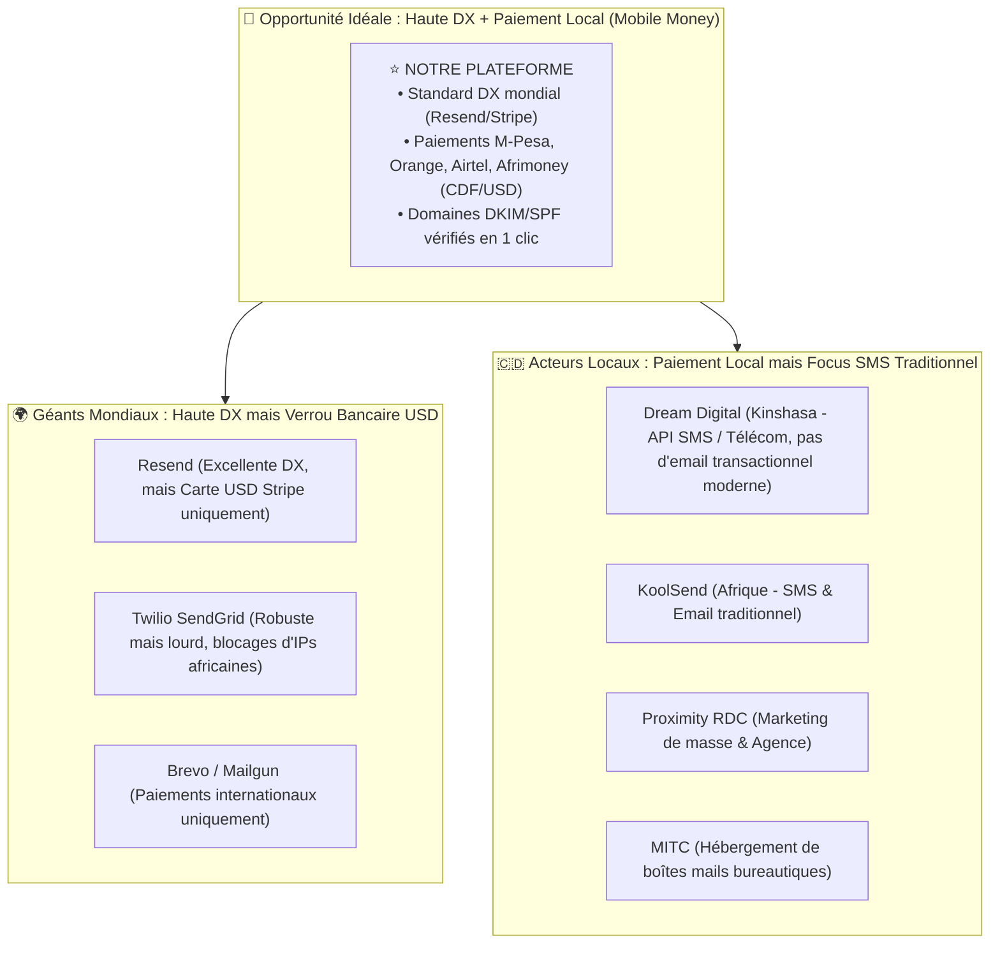

# 🇨🇩 05. Benchmark du Marché Congolais & Analyse Concurrentielle

Ce document dresse l'état des lieux du marché des plateformes et APIs de communication (Email, SMS, OTP, Notifications) en **République Démocratique du Congo (RDC)** et en Afrique centrale, identifie les acteurs en place, analyse leurs forces et faiblesses, et définit notre positionnement stratégique.

---

## 1. Contexte & État des Lieux en RDC

Le marché technologique congolais (Kinshasa, Lubumbashi, Goma, etc.) est en pleine explosion avec la multiplication des **Fintechs, SaaS locaux, e-commerces, agences web et services bancaires**.

### La Réalité Actuelle des Développeurs Congolais
1. **Dépendance totale aux plateformes étrangères pour l'Email** : La quasi-totalité des développeurs et entreprises en RDC utilise **Resend, SendGrid (Twilio), Brevo (ex-Sendinblue), Mailgun ou AWS SES**.
2. **Le Défi du Paiement International** : Les cartes bancaires internationales (Visa/Mastercard) ont souvent des plafonds stricts, des frais de change élevés, ou sont fréquemment refusées par les passerelles comme Stripe. L'absence de paiement par **Mobile Money (M-Pesa, Orange Money, Airtel Money, Afrimoney)** exclut de nombreux créateurs et PME.
3. **Le canal SMS/OTP domine le B2C, l'Email domine le B2B/SaaS** : Si le SMS est roi pour toucher la masse populaire congolaise, l'**Email transactionnel reste indispensable** pour les applications professionnelles, confirmations de commande, factures PDF, réinitialisations de mot de passe, dashboards et services administratifs.

---

## 2. Benchmark des Acteurs Locaux & Régionaux

### A. Acteurs Locaux & Régionaux (RDC / Afrique)

#### 1. Dream Digital (Kinshasa)
- **Positionnement** : Opérateur télécom CPaaS & ITSP basé à Kinshasa.
- **Services** : API SMS pour OTP bancaires/fintechs, campagnes SMS, VoIP, WhatsApp Business.
- **Forces** : Présence physique à Kinshasa, interconnexion directe avec les opérateurs télécoms (Vodacom, Airtel, Orange, Africell), paiement local.
- **Faiblesses** : Très axé sur le **SMS et la téléphonie**, pas d'offre moderne dédiée aux **emails transactionnels** (pas de DKIM automatisé, pas d'API mail style Resend, pas de SDK client browser).

#### 2. KoolSend (Afrique / Présence RDC)
- **Positionnement** : Plateforme d'envoi d'e-mails et de SMS transactionnels pour le marché africain.
- **Forces** : Prise en compte des spécificités africaines de délivrabilité, routes locales.
- **Faiblesses** : Interface utilisateur plus traditionnelle, documentation développeur perfectible, absence de SDKs frontend modernes légers (style EmailJS).

#### 3. Proximity RDC (Kinshasa)
- **Positionnement** : Agence de marketing digital et d'envoi en masse (Email marketing & SMS).
- **Forces** : Facturation locale, accompagnement commercial sur Kinshasa.
- **Faiblesses** : Solution d'**agence / marketing de masse** (type Mailchimp) plutôt qu'une **infrastructure API transactionnelle** pour les développeurs logiciels.

#### 4. MITC (Mulangane IT Consult - Kinshasa)
- **Positionnement** : Hébergeur cloud et intégrateur de messageries d'entreprises.
- **Forces** : Hébergement local, support de proximité.
- **Faiblesses** : Offres orientées boîtes mails collaboratives (Exchange / cPanel / Zimbra), pas une plateforme d'APIs transactionnelles.

---

### B. Géants Internationaux (Utilisés par défaut en RDC)

| Plateforme | Points Forts | Points Faibles pour la RDC |
| :--- | :--- | :--- |
| **Resend** | DX exceptionnelle, React Email, logs en direct ultra-propres, API simple. | Paiement uniquement par carte bancaire internationale (Stripe), support en anglais, aucune intégration Mobile Money. |
| **SendGrid (Twilio)** | Très haute réputation IP, robustesse éprouvée. | Interface complexe, prix élevés, support distant, comptes souvent bloqués arbitrairement lors de l'inscription depuis des IPs africaines. |
| **Brevo (ex-Sendinblue)** | Support multicanal (Email + SMS), interface en français. | Documentation API moins fluide pour les développeurs purs, validation stricte des comptes souvent bloquante pour les nouvelles startups. |
| **EmailJS** | Envoi direct sans backend pour les formulaires. | Pas de gestion de domaines DNS avancée, paywall en USD, pas d'API backend unifiée. |

---

## 3. Matrice d'Analyse Comparative Détaillée

| Critères d'Évaluation | Acteurs Locaux (Dream Digital, Proximity) | Acteurs Internationaux (Resend, SendGrid) | **Notre Plateforme (Objectif)** |
| :--- | :---: | :---: | :---: |
| **API Transactionnelle moderne** | ⚠️ Partiel (surtout SMS) | ✅ Excellente | ✅ **Excellente (style Resend)** |
| **SDK Frontend (sans backend)** | ❌ Aucun | ⚠️ Limité (EmailJS séparé) | ✅ **Natif (style EmailJS)** |
| **Paiement Mobile Money (M-Pesa, Orange, Airtel)** | ✅ Oui | ❌ Non (Carte USD requise) | ✅ **Oui (M-Pesa, Orange, Airtel, Visa/Mastercard)** |
| **Facturation en Francs Congolais (CDF) / USD** | ✅ Oui | ❌ USD uniquement | ✅ **CDF & USD** |
| **Vérification DNS DKIM / SPF automatique** | ❌ Manuel | ✅ Automatisé | ✅ **Automatisé en 1 clic** |
| **Support de proximité (Kinshasa / FR / Lingala)** | ✅ Oui | ❌ Non (Tickets anglophones lents) | ✅ **Oui (Support WhatsApp & Direct)** |
| **Risque de blocage de compte (IP africaine)** | Faible | ⚠️ Élevé (Faux positifs anti-fraude) | **Nul (Conçu pour l'écosystème local)** |

---

## 4. Proposition de Valeur Unique (USP) & Opportunités Stratégiques

### 1. La Première Plateforme "Developer-First" Conçue pour l'Afrique
Combler le fossé entre la qualité d'expérience développeur de **Resend / EmailJS** et les réalités économiques locales congolaises.

### 2. Intégration Native des Paiements Locaux
Permettre aux développeurs, freelances et startups de recharger leurs quotas d'emails instantanément via :
- **M-Pesa (Vodacom)**
- **Orange Money**
- **Airtel Money**
- **Afrimoney**
- **Cartes bancaires locales (Illocash, Rawbank, Equity BCDC, MaxiCash)**

### 3. Modèle Hybride Unique : Backend (Resend) + Frontend (EmailJS)
Offrir une seule plateforme et une seule console pour :
- Envoyer des reçus de paiement et des OTPs depuis un backend Node/Python/PHP.
- Envoyer les messages d'un formulaire de contact directement depuis un site vitrine sans payer un hébergement serveur.

### 4. Passerelle Future vers le Multicanal (Email + SMS RDC + WhatsApp)
En phase 2, la plateforme pourra unifier sous une même API :
- `POST /v1/emails`
- `POST /v1/sms` (interconnexion avec les passerelles Vodacom, Airtel, Orange)
- `POST /v1/whatsapp` (notifications transactionnelles WhatsApp)
