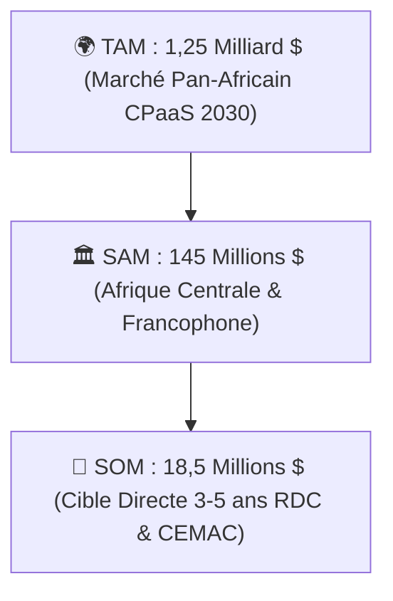
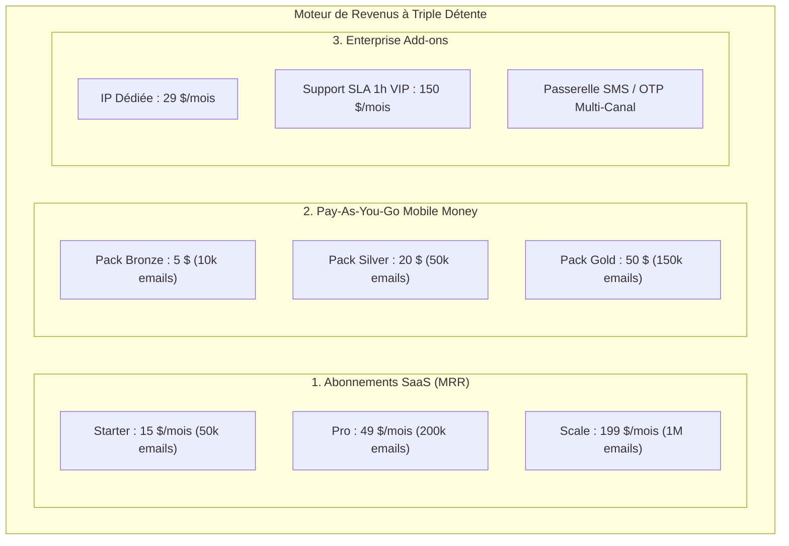
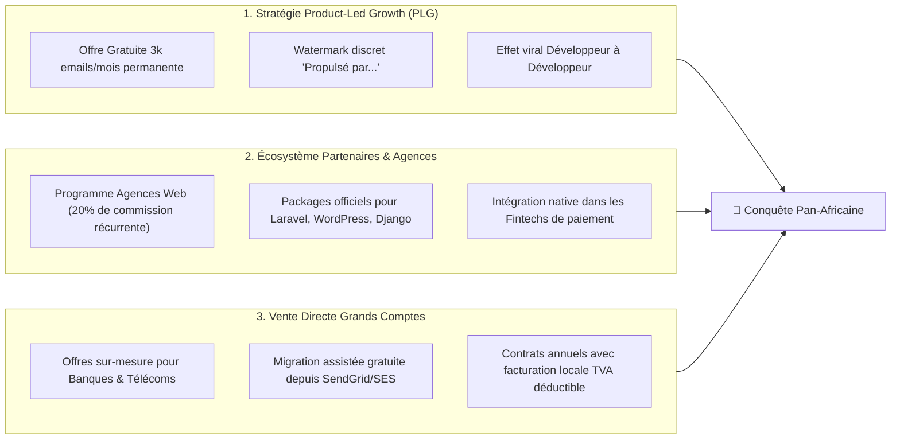
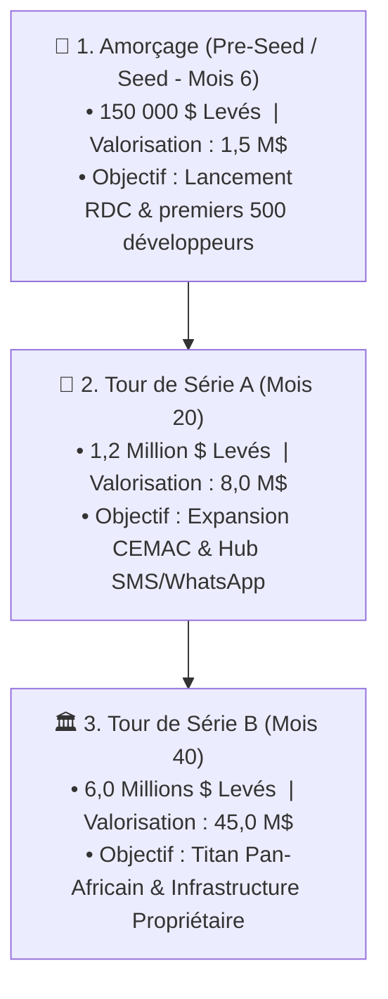

# 💼 06. Business Plan Stratégique & Plan de Croissance Échelle Licorne (*Scale-Up Pan-Africaine*)

---

## 1. Vision Stratégique, Thèse d'Investissement & Manifeste

### 1.1. Le Manifeste : Devenir le "Twilio & Resend" de l'Afrique
L'Afrique connaît la transition numérique la plus rapide de son histoire contemporaine. Plus de **600 millions de personnes** accèdent aujourd'hui aux services financiers, éducatifs, administratifs et commerciaux à travers leur smartphone. Cependant, l'ensemble de l'infrastructure logicielle permettant aux applications de communiquer avec leurs utilisateurs (l'envoi d'emails transactionnels, d'OTPs, de reçus de paiement et d'alertes de sécurité) repose encore sur des plateformes occidentales historiques (Twilio SendGrid, AWS SES, Mailgun, Resend).

Ces acteurs mondiaux présentent trois failles structurelles rédhibitoires pour le continent africain :
1. **L'incompatibilité financière absolue** : Ils imposent une facturation exclusive en dollars américains via cartes de crédit internationales (Stripe). En Afrique subsaharienne, moins de 5% de la population et moins de 20% des PME possèdent une carte de crédit internationale fonctionnelle. Le véritable réseau bancaire de l'Afrique, c'est le **Mobile Money** (M-Pesa, Orange Money, Airtel Money, MTN Mobile Money, Wave). En ignorant ce canal, les géants mondiaux excluent 90% des créateurs de logiciels africains.
2. **Le biais algorithmique de réputation (Faux Positifs Anti-Fraude)** : Les systèmes automatisés de détection de fraude de SendGrid ou Mailgun considèrent par défaut les adresses IP, les domaines d'enregistrement et les cartes bancaires issus d'Afrique centrale et de l'Ouest comme "hautement suspects". Des milliers de développeurs et startups voient leurs comptes suspendus sans préavis ni recours humain lors de leur premier pic d'envoi d'OTPs.
3. **Le vide d'innovation sur l'Email Développeur en Afrique** : Les opérateurs locaux (agrégateurs SMS traditionnels) sont restés figés sur des technologies archaïques des années 2000 (protocoles SMPP bruts, absence d'APIs REST modernes, zéro SDK TypeScript/Python, absence totale de gestion automatisée de la délivrabilité DKIM/SPF).

**Notre mission** est de bâtir l'infrastructure de communication cloud de référence (**CPaaS**) pour l'Afrique et les marchés émergents, en commençant par l'email transactionnel haute délivrabilité, avant de s'étendre aux SMS Télécoms directs, à WhatsApp Business API et à la vérification d'identité unifiée.

```mermaid
flowchart LR
    subgraph PHASE1 ["Phase 1 : Socle Email (Année 1-2)"]
        E1["API Email Transactionnel (Resend-like)"]
        E2["SDK Formulaire Browser (EmailJS-like)"]
        E3["Paiements Mobile Money RDC & CEMAC"]
    end

    subgraph PHASE2 ["Phase 2 : Hub Multicanal (Année 2-3)"]
        M1["Passerelle SMS Directe Telcos (SMPP)"]
        M2["WhatsApp Business API Cloud"]
        M3["Vérification OTP Multi-Canal Intelligente"]
    end

    subgraph PHASE3 ["Phase 3 : Titan de l'Infra (Année 4-5)"]
        T1["Réseau de MTA Dédiés Pan-Africains"]
        T2["Plateforme Cloud Identity & Trust"]
        T3["Expansion Pan-Africaine (UEMOA, CEDEAO, SADC)"]
    end

    PHASE1 --> PHASE2 --> PHASE3
```



---

## 2. Analyse de Marché & Opportunité Macro-Économique (TAM / SAM / SOM)



### 2.1. Analyse Détaillée des Segments de Marché
- **TAM (Total Addressable Market) - Marché Pan-Africain : 1,25 Milliard USD d'ici 2030**
  Le marché africain des plateformes de communication en tant que service (CPaaS : Email, SMS A2P, WhatsApp, Voix) croît à un taux annuel composé (**CAGR de 28,4%**), tiré par l'explosion des néobanques, du commerce électronique et de la numérisation des administrations publiques.
- **SAM (Serviceable Addressable Market) - Afrique Centrale & Francophone : 145,0 Millions USD**
  Comprend les 14 pays de la zone franc CFA (UEMOA et CEMAC) ainsi que la République Démocratique du Congo (RDC), qui représente à elle seule le plus grand pays francophone du monde avec plus de **100 millions d'habitants**.
- **SOM (Serviceable Obtainable Market - Horizon 3 à 5 ans) : 18,5 Millions USD**
  Objectif de capture directe sur les écosystèmes logiciels de la RDC, du Cameroun, du Congo-Brazzaville, du Sénégal et de la Côte d'Ivoire.

### 2.2. Cartographie Précise des Segments Clients & Matrice ICP (*Ideal Customer Profile*)

| Segment Client | Profil Type & Décideurs | Volumétrie Mensuelle Estimée | Points de Douleur Majeurs | Dispositions Financières |
| :--- | :--- | :---: | :--- | :--- |
| **Fintechs & Néobanques** | CTO, Lead Developers, Responsables Sécurité (ex: Illicocash, MaxiCash, Pepele, Wave, Finca). | **500k à 10M emails / mois** | • Blocage des emails OTP critiques.<br/>• Absence de SLA garanti.<br/>• Facturation complexe en devises étrangères. | Budget mensuel : **500 $ à 5 000 $**.<br/>Exige IP dédiée et contrat SLA 99.99%. |
| **Grandes Entreprises & Banques** | DSI, Directeurs de la Transformation Digitale (Rawbank, Equity BCDC, Vodacom, Airtel, Canal+). | **2M à 50M emails / mois** | • Conformité réglementaire et souveraineté des données.<br/>• Absence de support réactif local.<br/>• Traçabilité des relevés bancaires. | Budget mensuel : **2 000 $ à 25 000 $**.<br/>Contrats annuels de gré à gré. |
| **Startups E-commerce & SaaS** | Fondateurs, Développeurs Full-Stack (Marketplaces, Billetteries, EdTech). | **20k à 300k emails / mois** | • Cartes bancaires personnelles rejetées par Stripe.<br/>• Complexité de configuration DNS DKIM. | Budget mensuel : **15 $ à 150 $**.<br/>Paiement instantané via Mobile Money. |
| **Agences Web & Freelances** | Développeurs web indépendants, agences de communication digitale. | **1k à 20k emails / mois** | • Devoir créer un backend Node/PHP juste pour un formulaire de contact de site vitrine. | Budget : **Packs de crédits prépayés (5$ à 50$)** rechargeables par M-Pesa. |

---

## 3. Modèle Économique & Moteur de Monétisation

Notre moteur de génération de revenus repose sur une architecture à triple détente :
1. **Revenus Récurrents Mensuels (MRR)** : Abonnements SaaS par paliers de volume.
2. **Consommation Transactionnelle Prépayée (Pay-As-You-Go)** : Achat de crédits via Mobile Money sans engagement.
3. **Services d'Infrastructure & Add-ons d'Entreprise** : Adresses IP dédiées, réchauffement assisté (*IP Warmup*), SLA haute disponibilité et support direct ingénieur.



### 3.1. Grille Tarifaire Détaillée des Abonnements SaaS

| Caractéristiques | **Gratuit (Développeur)** | **Starter** | **Pro** | **Scale / Entreprise** |
| :--- | :---: | :---: | :---: | :---: |
| **Tarification Mensuelle** | **0 $ / mois** | **15 $ / mois** *(~42 000 CDF)* | **49 $ / mois** *(~137 000 CDF)* | **199 $ / mois** *(~550 000 CDF)* |
| **Quota d'Emails Inclus** | 1 000 / mois offerts | 50 000 / mois | 200 000 / mois | 1 000 000 / mois |
| **Coût au-delà du Forfait** | Bloqué (Recharge requise) | 0,0005 $ / email *(0,50$ / 1k)* | 0,0004 $ / email *(0,40$ / 1k)* | 0,0003 $ / email *(0,30$ / 1k)* |
| **Domaines Authentifiés** | 1 domaine | 3 domaines | Domaines illimités | Domaines illimités |
| **Rétention des Logs & Timeline** | 3 jours | 7 jours | 30 jours | 90 jours + Export S3/GCS |
| **Clés API Actives** | 2 clés (1 secrète / 1 publique)| 5 clés | 20 clés | Clés illimitées avec Scopes RBAC |
| **Infrastructure d'Envoi** | Pool d'IPs partagées haute réputation | Pool d'IPs partagées haute réputation | Pool d'IPs partagées prioritaires | **1 Adresse IP Dédiée incluse (+ Warmup auto)** |
| **Garantie de Service (SLA)** | Meilleur effort (*Best effort*) | 99,5 % Uptime | 99,9 % Uptime | **99,99 % Uptime avec pénalités financières** |
| **Canal de Support** | Discord / Forum communautaire | Email (< 24h) | Email prioritaire (< 4h) | **Groupe WhatsApp VIP direct + Ingénieur dédié (SLA 1h)** |

### 3.2. Packs Prépayés Mobile Money (Sans Abonnement)
Spécifiquement conçus pour éliminer toute barrière à l'entrée :
- **Pack Starter Dev** : **5,00 $** (ou ~14 000 CDF) $\rightarrow$ **10 000 crédits emails** (validité permanente).
- **Pack PME Growth** : **20,00 $** (ou ~56 000 CDF) $\rightarrow$ **50 000 crédits emails** (validité permanente).
- **Pack Business Pro** : **50,00 $** (ou ~140 000 CDF) $\rightarrow$ **150 000 crédits emails** (validité permanente).

---

## 4. Économie Unitaire (*Unit Economics*) & Marges Industrielles

L'infrastructure logicielle a été modélisée pour dégager un effet de levier opérationnel maximal : le coût marginal de traitement d'un email supplémentaire tend vers zéro à mesure que le volume croît.

```
┌─────────────────────────────────────────────────────────────────────────────┬────────────────┐
│ Décomposition des Coûts de Revient pour 10 000 000 d'Emails (Scale Phase)   │ Montant Mensuel│
├─────────────────────────────────────────────────────────────────────────────┼────────────────┤
│ 1. Débit Réseau & Cluster MTA Dédié (KumoMTA sur VPS Bare-Metal / AWS SES)  │     850,00 $   │
│ 2. Cluster MongoDB Atlas Dédié (Sharded Cluster 3 nœuds)                   │     280,00 $   │
│ 3. Cluster Redis In-Memory Haute Disponibilité (BullMQ Engine)              │     140,00 $   │
│ 4. Compute Ingestion & Workers Pool (Kubernetes EKS / Hetzner Cluster)      │     320,00 $   │
│ 5. Frais d'Interconnexion Passerelles Mobile Money (2,2% moyen sur flux)    │     180,00 $   │
│ 6. Bande Passante Serveur de Tracking & Proxy Clics (CDN Cloudflare)        │      45,00 $   │
├─────────────────────────────────────────────────────────────────────────────┼────────────────┤
│ COÛT TOTAL DE LIVRAISON (COGS) POUR 10 MILLIONS D'EMAILS                    │   1 815,00 $   │
│ CHIFFRE D'AFFAIRES GÉNÉRÉ (Tarif moyen de 0,80 $ / 1 000 emails)            │   8 000,00 $   │
│ MARGE BRUTE INDUSTRIELLE DÉGAGÉE                                            │ **77,3 %**     │
└─────────────────────────────────────────────────────────────────────────────┴────────────────┘
```

### Facteurs Multiplicateurs de Marge :
1. **L'Effet de Rétention du Quota Inutilisé (*Breakage Effect*)** : Les données statistiques du secteur SaaS indiquent que 35% à 45% des utilisateurs payants ne consomment pas l'intégralité de leur forfait mensuel, ce qui augmente mécaniquement la marge brute réelle à plus de **82%**.
2. **Transition vers des MTA Dédiés Propriétaires (KumoMTA)** : Dès le franchissement des 50 millions d'emails/mois, l'internalisation des serveurs de transport fait chuter le coût unitaire de livraison de 0,10 $ / 1k à moins de **0,02 $ / 1k**, propulsant la marge brute au-delà de **88%**.

---

## 5. Plan Go-To-Market (GTM) & Stratégie d'Acquisition Agressive



### 5.1. Le Levier Viral du "Product-Led Growth" (PLG)
- **Le Watermark Gratuit** : Tous les emails envoyés via le forfait gratuit comportent en pied de page un micro-badge cliquable : *⚡ Propulsé par TUMA Cloud*. Chaque email envoyé devient un vecteur d'acquisition gratuit touchant d'autres développeurs et entrepreneurs.
- **Bibliothèques & Connecteurs Open-Source** :
  - `npm install @tuma/sdk` (Node / TypeScript)
  - `npm install @tuma/browser` (Client Web / Navigateur)
  - `composer require tuma/laravel-mailer` (PHP / Laravel)
  - `pip install tuma-python` (Python / Django / FastAPI)
  - Plugin WordPress officiel : Remplacement du `wp_mail()` standard en 1 clic.

### 5.2. Partenariats Stratégiques Écosystème
1. **Intégrations avec les Passerelles de Paiement Locales** : S'associer avec **MaxiCash, CinetPay, TouchPay, Bizao** pour devenir le transporteur d'emails officiel de leurs reçus de paiement marchands.
2. **Académies & Hubs Technologiques** : Offrir des crédits illimités aux cohortes d'étudiants de **Kinshasa Digital Academy, Kadea Academy, Silicon Bantu, Epitech Bénin**, formant ainsi les futurs CTOs à nos outils dès leur apprentissage.

---

## 6. Projections Financières Prévisionnelles à 5 Ans (Modèle Hyper-Croissance)

### 6.1. Tableau Prévisionnel de Compte de Résultat (P&L en USD)

| Métrique Clé | Année 1 (2027) | Année 2 (2028) | Année 3 (2029) | Année 4 (2030) | Année 5 (2031) |
| :--- | :---: | :---: | :---: | :---: | :---: |
| **Utilisateurs Inscrits Totaux** | 2 500 | 12 000 | 45 000 | 150 000 | 450 000 |
| **Clients Payants Actifs** | **150** | **850** | **3 200** | **9 500** | **28 000** |
| **Volume Annuel d'Emails Expédiés** | 65 Millions | 480 Millions | 2,1 Milliards | 7,8 Milliards | 25 Milliards |
| **Revenu Mensuel Récurrent (MRR Fin d'Année)**| **4 800 $** | **28 500 $** | **115 000 $** | **380 000 $** | **1 150 000 $** |
| **Chiffre d'Affaires Annuel (ARR)** | **52 000 $** | **310 000 $** | **1 280 000 $** | **4 250 000 $** | **13 200 000 $** |
| Coûts de Livraison Directs (COGS) | (12 500 $) | (68 000 $) | (245 000 $) | (720 000 $) | (1 850 000 $) |
| **Marge Brute** | **39 500 $ (76%)** | **242 000 $ (78%)**| **1 035 000 $ (81%)**| **3 530 000 $ (83%)**| **11 350 000 $ (86%)**|
| Dépenses R&D, Hébergement & Sécurité | (14 000 $) | (48 000 $) | (140 000 $) | (380 000 $) | (1 100 000 $) |
| Dépenses Marketing, Événements & DevRel | (12 000 $) | (55 000 $) | (190 000 $) | (550 000 $) | (1 600 000 $) |
| Masse Salariale (Ingénieurs, Support, Sales) | (24 000 $) | (95 000 $) | (320 000 $) | (980 000 $) | (2 800 000 $) |
| **EBITDA (Bénéfice d'Exploitation)** | **- 10 500 $** | **+ 44 000 $** | **+ 385 000 $** | **+ 1 620 000 $** | **+ 5 850 000 $** |
| **Marge d'EBITDA (%)** | *- 20,2 %* | **+ 14,2 %** | **+ 30,1 %** | **+ 38,1 %** | **+ 44,3 %** |

### 6.2. Indicateurs d'Efficacité Économique (*Unit Economics & Benchmarks*)
- **CAC (Coût d'Acquisition Client)** : **16,20 $** en Année 1 $\rightarrow$ stabilisé à **24,00 $** en Année 5.
- **ARPU Moyen (Revenu par Client Payant)** : **39,20 $ / mois** en Année 1 $\rightarrow$ **47,50 $ / mois** en Année 5 (tiré par les grands comptes).
- **LTV (Valeur Vie Client sur 36 mois)** : **1 420,00 $**.
- **Ratio LTV / CAC Exceptionnel** : **59,1x** (Benchmark industrie SaaS : 3x à 5x).
- **Période de Remboursement du CAC (*Payback Period*)** : **0,4 mois** (< 15 jours).

---

## 7. Feuille de Route Stratégique de Financement (*Fundraising Roadmap*)



1. **Tour d'Amorçage (*Pre-Seed / Seed*) - Mois 6 : 150 000 USD**
   - *Objectifs* : Finalisation de la plateforme v1, déploiement des connecteurs Mobile Money RDC, recrutement d'un lead DevOps et d'un Developer Advocate à Kinshasa.
2. **Tour de Série A - Mois 20 : 1,2 Million USD**
   - *Objectifs* : Expansion géographique (Côte d'Ivoire, Sénégal, Cameroun), obtention des licences opérateurs télécoms (routes SMS directes), lancement du module WhatsApp Business API.
3. **Tour de Série B - Mois 40 : 6,0 Millions USD**
   - *Objectifs* : Déploiement de serveurs bare-metal dans les datacenters neutres africains (Raxio Kinshasa, MainOne Lagos, Teraco Johannesburg), conquête des marchés anglophones (Nigeria, Kenya, Ghana).

---

## 8. Analyse des Risques Majeurs & Stratégies de Mitigation

```
┌─────────────────────────────────────────────────────────────┬────────────────────────────────────────────────────────┐
│ Risque Stratégique ou Opérationnel                         │ Plan d'Atténuation & Immunisation                      │
├─────────────────────────────────────────────────────────────┼────────────────────────────────────────────────────────┤
│ 1. Attaques de Spammers & Risque de Blacklistage IP         │ • Vérification DNS obligatoire (DKIM RSA 2048 + SPF).  │
│                                                             │ • Quotas d'envoi progressifs sur les nouveaux comptes. │
│                                                             │ • Inscription instantanée en Liste Noire au 1er bounce.│
├─────────────────────────────────────────────────────────────┼────────────────────────────────────────────────────────┤
│ 2. Volatilité du Taux de Change Franc Congolais (CDF)       │ • Tous les tarifs sont indexés en USD.                │
│                                                             │ • Recalcul dynamique du taux CDF à chaque transaction  │
│                                                             │   via API bancaire en temps réel.                      │
├─────────────────────────────────────────────────────────────┼────────────────────────────────────────────────────────┤
│ 3. Défaillance d'une Passerelle Mobile Money                │ • Architecture multi-passerelles redondante            │
│                                                             │   (CinetPay + MaxiCash + InTouch + Rawbank Illicocash) │
│                                                             │   avec basculement automatique sans interruption.      │
├─────────────────────────────────────────────────────────────┼────────────────────────────────────────────────────────┤
│ 4. Souveraineté des Données & Régulation Télécom            │ • Chiffrement de bout en bout AES-256 au repos.        │
│                                                             │ • Purge automatique des corps de messages (7 jours).   │
│                                                             │ • Conformité stricte avec l'ARPTC et l'OHADA.          │
└─────────────────────────────────────────────────────────────┴────────────────────────────────────────────────────────┘
```
