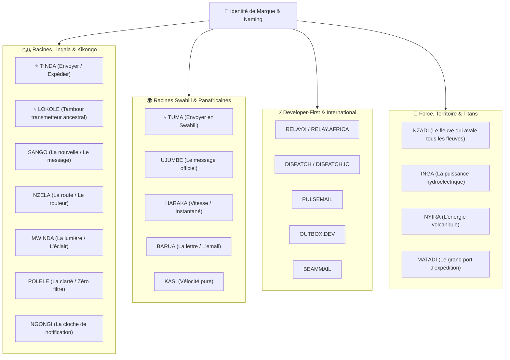
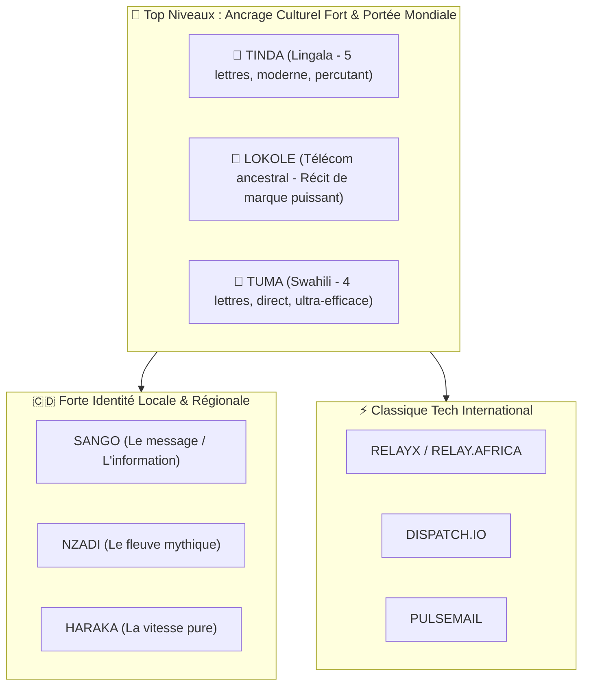

# 🎨 08. Guide de Naming, Identité de Marque & Propositions Créatives

Ce document consigne l'ensemble des propositions de noms, leur étymologie culturelle et linguistique, leur impact pour les développeurs (*Developer Experience*), leurs déclinaisons de domaines et leurs slogans associés.

---

## 1. Tableau Récapitulatif des Grandes Familles de Naming

---

## 2. Analyse Détaillée par Catégorie

---

### Catégorie A : Les Trésors du Lingala & du Kikongo 🇨🇩

Des termes courts, chantants, ultra-évidents pour l'écosystème local et dotés d'une sonorité moderne à l'international :

| Nom | Traduction & Signification Culturelle | Pourquoi ce nom est un banger | Syntaxe Développeur (DX) | Domaines Cibles |
| :--- | :--- | :--- | :--- | :--- |
| **TINDA** ⭐ | **"Envoyer / Expédier"** en Lingala. | Le verbe d'action par excellence. 5 lettres, 2 syllabes, mémorisable instantanément dans le monde entier. | `import { tinda } from '@tinda/sdk';` `await tinda.send({ ... });` | `tinda.dev` `tinda.io` `tinda.cd` `tinda.africa` |
| **LOKOLE** ⭐ | **Le tambour à fente traditionnel**. Historiquement, le Lokole transmettait les messages urgents de village en village à travers le fleuve et la forêt. | L'incarnation historique de la communication et des réseaux de transmission en RDC. | `import { Lokole } from '@lokole/node';` `await lokole.transmit({ ... });` | `lokole.dev` `lokole.io` `lokole.africa` |
| **SANGO** | **"La nouvelle / L'information / Le message"** en Lingala. | Naturel, chaleureux, sonne comme un service de messagerie universel. | `import { sango } from '@sango/sdk';` `await sango.deliver({ ... });` | `sango.dev` `sango.io` |
| **NZELA** | **"Le chemin / La route"** en Lingala. | Évoque le routage intelligent, le pipeline d'envoi et la voie directe vers la boîte de réception. | `import { nzela } from '@nzela/engine';` `await nzela.route({ ... });` | `nzela.dev` `nzela.io` |
| **MWINDA** | **"La lumière / L'éclair"** en Lingala. | Symbole de la vitesse de la lumière ($< 30\text{ms}$) et de la clarté des logs. | `import { Mwinda } from '@mwinda/sdk';` `await mwinda.send({ ... });` | `mwinda.dev` `mwinda.io` |
| **POLELE** | **"Clair / Transparent / Évident"** en Lingala. | Fait écho à la transparence des métriques de délivrabilité et à la propreté de l'API. | `import { polele } from '@polele/sdk';` `await polele.send({ ... });` | `polele.dev` `polele.io` |
| **NGONGI** | **La cloche traditionnelle / L'avertisseur**. | Évoque le signal de notification instantané (le ping de réception). | `import { ngongi } from '@ngongi/mail';` `await ngongi.notify({ ... });` | `ngongi.dev` `ngongi.io` |

---

### Catégorie B : L'Énergie du Swahili & de l'Afrique de l'Est 🌍

Des mots percutants utilisés par plus de 200 millions de personnes du Congo à l'Océan Indien :

| Nom | Traduction & Signification | Atout Majeur | Exemple d'Intégration SDK |
| :--- | :--- | :--- | :--- |
| **TUMA** ⭐ | **"Envoyer / Transmettre"** en Swahili. | 4 lettres ! Aussi court et direct que *Stripe* ou *Twilio*. | `import { tuma } from '@tuma/sdk';` `await tuma.send({ ... });` |
| **HARAKA** | **"Vite / Instantané / Rapide"** en Swahili. | Souligne la latence ultra-faible ($< 30\text{ms}$) de l'ingestion API. | `import { haraka } from '@haraka/mail';` `await haraka.dispatch({ ... });` |
| **UJUMBE** | **"Le message officiel / La dépêche"** en Swahili. | Noble et formel, idéal pour les emails bancaires et transactionnels d'entreprises. | `import { ujumbe } from '@ujumbe/api';` `await ujumbe.send({ ... });` |
| **BARUA** | **"La lettre / Le courrier électronique"** en Swahili. | L'évidence pour une plateforme de courrier digital. | `import { barua } from '@barua/sdk';` `await barua.send({ ... });` |
| **KASI** | **"Vélocité / Puissance motrice"** en Swahili. | Évoque le débit massif (1 000+ emails/sec). | `import { kasi } from '@kasi/engine';` `await kasi.push({ ... });` |

---

### Catégorie C : Puissance Territoriale, Géographie & Titans 🌋

Des noms qui incarnent la force géologique et industrielle du bassin du Congo :

| Nom | Référence Géographique / Historique | Message de Marque |
| :--- | :--- | :--- |
| **NZADI** | L'ancien nom du fleuve Congo (*"Le fleuve qui avale tous les fleuves"*). | La plateforme d'infrastructure capable d'engloutir et de router des milliards de messages. |
| **INGA** | Le complexe hydroélectrique d'Inga (le plus grand potentiel énergétique du monde). | La puissance brute d'infrastructure cloud, l'énergie inépuisable. |
| **NYIRA** | Inspiré du volcan *Nyiragongo*. | Le feu de l'action, l'énergie technologique qui jaillit de l'Est du Congo. |
| **MATADI** | Le port maritime d'expédition internationale de la RDC. | Le point de départ où toutes les données sont expédiées vers le reste du monde. |

---

### Catégorie D : Les Noms Techniques "Developer-First" Purs ⚡

Pour une marque résolument tournée vers l'écosystème open-source international :

| Nom | Concept | Pourquoi les développeurs aiment |
| :--- | :--- | :--- |
| **RELAYX** / **RELAY.AFRICA** | Le relais haute vélocité. | Pureté technique, rappelle les relais SMTP nouvelle génération. |
| **DISPATCH** / **DISPATCH.IO** | L'aiguilleur de messages. | Précision chirurgicale et clarté du propos. |
| **PULSEMAIL** | Le pouls des transactions. | Parfait pour les OTPs, notifications de paiement et alertes critiques. |
| **OUTBOX.DEV** | La boîte de sortie des applications. | Universel, compris par 100% des ingénieurs logiciels de la planète. |
| **BEAMMAIL** | L'envoi par faisceau lumineux. | Évoque la vitesse de la lumière et la modernité. |

---

## 3. Matrice d'Évaluation & Classement des Meilleures Options

---

## 4. Les 3 Grands Favoris Recommandés

### 🥇 1. `TINDA` (*"Envoyer" en Lingala*)
- **Pourquoi c'est le gagnant absolu** : C'est le verbe d'envoi le plus direct, sonne exactement comme une licorne technologique moderne (style *Figma, Canva, Vercel, Tinda*), 5 lettres, mémorisable en 1 seconde.
- **Slogan officiel** : *"L'API d'envoi d'emails conçue pour l'Afrique et les développeurs du monde entier."*
- **Domaines idéaux** : `tinda.dev`, `tinda.io`, `tinda.cd`, `tinda.africa`.

### 🥈 2. `LOKOLE` (*Le tambour de télécommunication ancestral*)
- **Pourquoi c'est un coup de génie culturel** : Le Lokole est littéralement le premier protocole de messagerie réseau de l'histoire du bassin du Congo. C'est l'union parfaite entre l'héritage africain et l'infrastructure cloud moderne.
- **Slogan officiel** : *"Le réseau de transmission moderne pour toutes vos notifications logicielles."*
- **Domaines idéaux** : `lokole.dev`, `lokole.io`, `lokole.africa`.

### 🥉 3. `TUMA` (*"Envoyer" en Swahili*)
- **Pourquoi c'est ultra efficace** : 4 lettres seulement ! Direct, percutant, compris par toute l'Afrique de l'Est et centrale.
- **Slogan officiel** : *"Envoyez des millions d'emails en quelques millisecondes."*
- **Domaines idéaux** : `tuma.dev`, `tuma.io`, `tuma.africa`.
