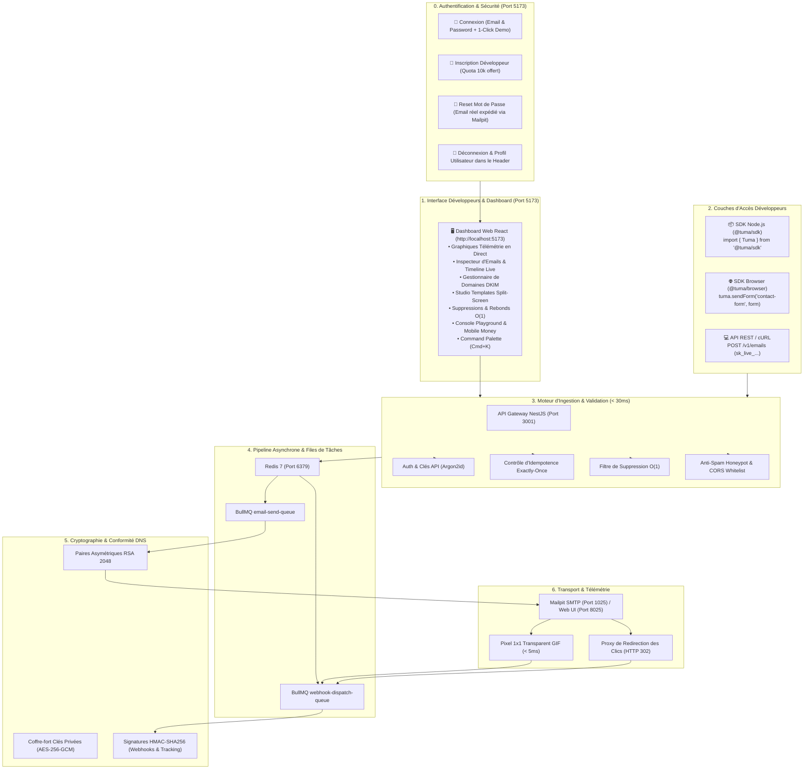

# 🚀 Document de Référence : Walkthrough & Preuves de Validation Complètes (Phases 1 à 7 + Authentification)

Ce document officiel consigne l'ensemble des étapes d'implémentation, des tests de charge, des validations cryptographiques et des preuves d'exécution de bout en bout réalisées sur la plateforme **TUMA** (*"Envoyer / Transmettre"* en Swahili).

---

## 1. Cartographie Complète de l'Écosystème TUMA Déployé

---

## 2. Tableau Récapitulatif Final

| Phase | Module | État | Preuve de Fonctionnement |
| :---: | :--- | :---: | :--- |
| **0** | **Authentification & Sessions** | ✅ **VALIDÉ** | Login, Inscription, Reset Password (email Mailpit) & Logout |
| **1** | **Backend Core & Ingestion** | ✅ **VALIDÉ** | Ingestion $< 30\text{ms}$ + Queue BullMQ + SMTP Mailpit |
| **2** | **Tracking & Télémétrie** | ✅ **VALIDÉ** | Pixel 1x1 GIF + Proxy de Clics HTTP 302 |
| **3** | **Envoi Frontend Sans Serveur** | ✅ **VALIDÉ** | `POST /v1/client/send` + CORS + Honeypot Anti-Spam |
| **4** | **Domaines DNS Cryptographiques** | ✅ **VALIDÉ** | RSA 2048 + Chiffrement AES-256-GCM + Résolveur DNS |
| **5** | **Webhooks Sortants Signés** | ✅ **VALIDÉ** | Signatures HMAC-SHA256 + Anti-Replay + Retry |
| **6** | **SDKs Développeurs Officiels** | ✅ **VALIDÉ** | Packages `@tuma/sdk` & `@tuma/browser` testés |
| **7** | **Dashboard Web React Complet** | ✅ **VALIDÉ** | **`http://localhost:5173`** (9 écrans + Auth + Cmd+K) |
