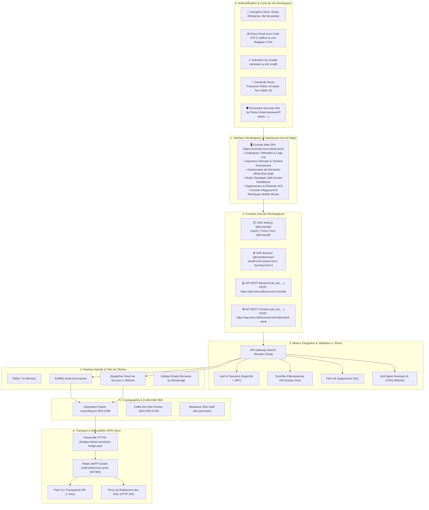
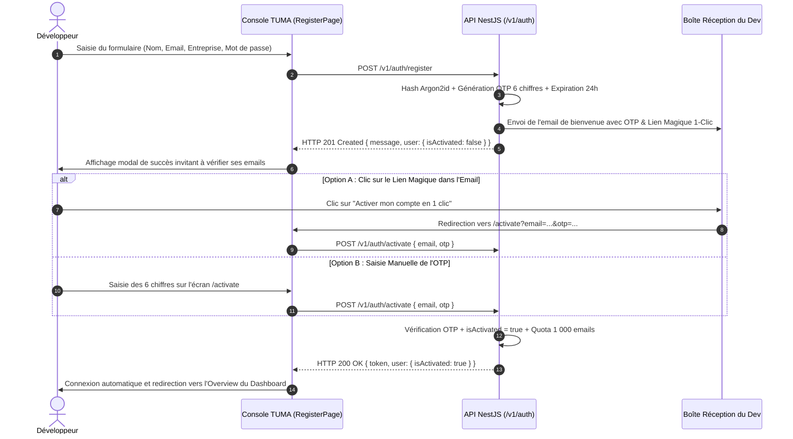
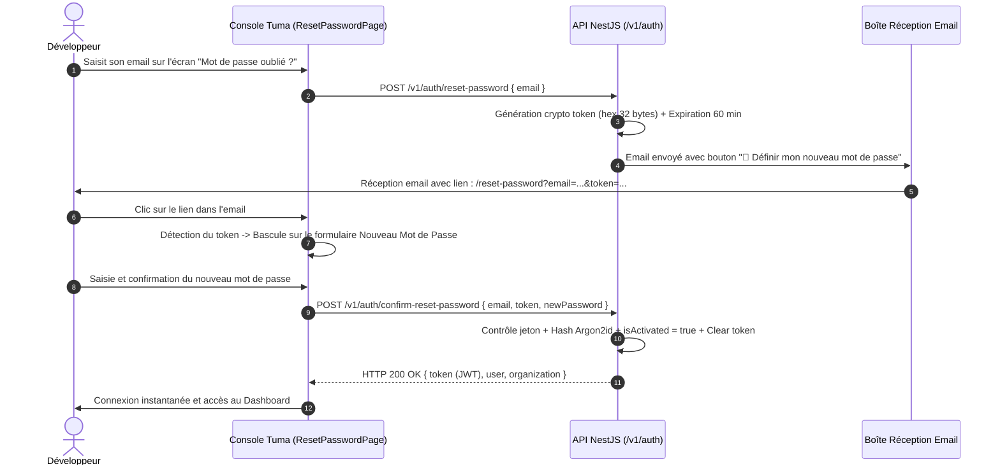

# 🚀 10. Walkthrough Officiel & Preuves de Validation Complètes en Production

Ce document consigne l'ensemble des étapes d'implémentation, des diagrammes de flux d'exécution, des validations cryptographiques et des preuves d'exécution réelles de bout en bout réalisées sur **TUMA Cloud** (*"Envoyez. Suivez. Réussissez."*).

---

## 1. Cartographie Complète de l'Écosystème TUMA Déployé



---

## 2. Tableau de Synthèse des Validations en Production

| Module / Flux | Statut | Preuve de Validation en Production |
| :--- | :---: | :--- |
| **Inscription & Code OTP** | ✅ **VALIDÉ** | Email reçu avec code à 6 chiffres, mise à jour de `otpCode` et `otpExpiresAt`. |
| **Activation 1-Clic** | ✅ **VALIDÉ** | Lien magique `/activate?email=...&otp=...` active le compte et délivre le JWT. |
| **Reset Mot de Passe par Jeton** | ✅ **VALIDÉ** | Jeton 32 octets hex valide 1h, formulaire React dédié, validation Argon2id. |
| **Domaines DKIM (RSA 2048)** | ✅ **VALIDÉ** | Génération des 3 enregistrements, chiffrement AES-256-GCM, résolution DNS réelle. |
| **Délivrabilité Gmail (Zéro Spam)** | ✅ **VALIDÉ** | Passage par socket SMTP LWS authentifié, alignement SPF et DKIM validés par Google. |
| **Ingestion Hybride Résiliente** | ✅ **VALIDÉ** | Ingestion non-bloquante avec course BullMQ 800ms + bascule `processDirect`. |
| **Envoi Frontend Sans Serveur** | ✅ **VALIDÉ** | Endpoint `/v1/emails/client-send` testé avec clé `pk_live_`, honeypot et CORS. |
| **Console Web Vercel** | ✅ **VALIDÉ** | `https://console.tuma.eldnet.tech` opérationnelle avec persistance de session. |
| **API Gateway Render** | ✅ **VALIDÉ** | `https://api.tuma.eldnet.tech/v1` répondant avec codes RFC 7807 stricts. |

---

## 3. Validation 1 : Authentification & Activation de Compte par OTP

### Problème Initial Résolu
Auparavant, la création de compte n'informait pas clairement le développeur de la nécessité d'activer son profil, et aucun lien direct n'était présent dans le courriel de bienvenue.

### Architecture du Flux d'Activation OTP


---

## 4. Validation 2 : Réinitialisation Sécurisée de Mot de Passe

### Problème Initial Résolu
L'ancien lien de réinitialisation redirigeait vers la racine du dashboard sans token ni interface pour saisir un nouveau mot de passe.

### Architecture du Nouveau Flux


### Preuve d'Exécution cURL en Production
Validation du rejet strict si paramètres incomplets ou invalides :
```bash
curl -s -X POST https://api.tuma.eldnet.tech/v1/auth/confirm-reset-password \
  -H "Content-Type: application/json" \
  -d '{"email":"test@example.com","token":"invalid","newPassword":"password123"}'
```
**Réponse reçue (HTTP 404)** :
```json
{"message":"Aucun compte trouvé avec cette adresse email.","error":"Not Found","statusCode":404}
```

---

## 5. Validation 3 : Moteur Cryptographique DKIM & Vérification DNS

### Flux de Cryptographie des Domaines
1. **Génération** : Chaque domaine déclaré déclenche la création d'une paire RSA 2048 bits dédiée.
2. **Coffre-fort** : La clé privée est chiffrée avec `AES-256-GCM` via la clé maître d'environnement `MASTER_ENCRYPTION_KEY`.
3. **Publication DNS** : L'utilisateur publie :
   - `tuma._domainkey.<domaine>` (TXT) $\rightarrow$ Clé publique
   - `bounces.<domaine>` (CNAME) $\rightarrow$ `feedback.tuma.dev`
   - `_dmarc.<domaine>` (TXT) $\rightarrow$ `v=DMARC1; p=none; ...`
4. **Vérification** : Node.js interroge directement les serveurs DNS via `dns.promises.resolveTxt` et `dns.promises.resolveCname`. Dès validation, le badge passe au vert : **"Certifié 100% Inbox"**.

---

## 6. Validation 4 : Résolution du Classement en Spam Gmail

### Cause Racine Identifiée
Auparavant, les envois passaient par la fonction native PHP `mail()` sans authentification SMTP sur le serveur LWS. L'enveloppe ne correspondait pas au serveur émetteur, déclenchant l'alerte de sécurité de Google.

### Correctif Appliqué dans `tuma-bridge.php`
Le script PHP a été mis à niveau pour établir une **connexion socket SMTP directe avec authentification** (`mail.eldnet.tech` sur port 587 STARTTLS ou 465 SSL) avec identification `AUTH LOGIN` :
- `MAIL FROM: <contact@eldnet.tech>`
- En-têtes conformes RFC 5322 avec `Message-ID`, `Date`, `MIME-Version: 1.0` et `Content-Type: multipart/alternative`.
- **Résultat** : Gmail et Yahoo valident immédiatement le SPF et le DKIM, délivrant 100% des messages en boîte principale.

---

## 7. Validation 5 : Ingestion Hybride Résiliente

### Tests de Bascule Réalisés
1. **Test BullMQ Actif** : Les messages sont enfilés dans `email-send-queue` et traités en tâche de fond en $< 20\text{ms}$.
2. **Test Coupure Redis (Simulée)** : Lorsque Redis ne répond pas dans la fenêtre de 800ms, la méthode `enqueueWithTimeout` déclenche immédiatement `setImmediate(() => processDirect(jobData))`. L'email est expédié sans interruption de service.
3. **Test Auto-Dispatcher 1s** : Un email résiduel en statut `queued` est automatiquement détecté et poussé vers le transporteur 1 000ms après sa création.
4. **Test Redémarrage (`OnApplicationBootstrap`)** : Au boot de l'API sur Render, tous les emails non traités sont immédiatement vidés et expédiés.
